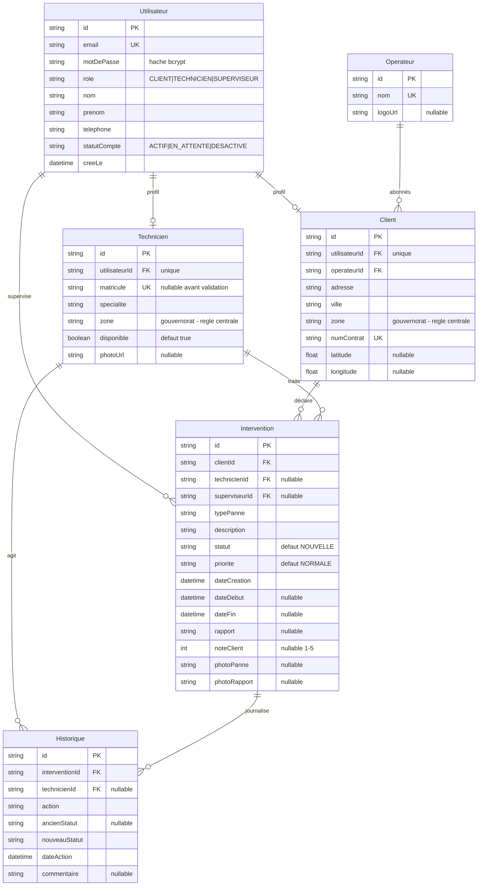

# FibreConnect

**FibreConnect est un sous-traitant de maintenance fibre optique en Tunisie.**
Ses techniciens sont ses propres employés : ils n'appartiennent à aucun
opérateur. La société dépanne les abonnés de deux réseaux partenaires —
Tunisie Telecom et Ooredoo — et chaque technicien couvre un **secteur
géographique**.

Trois profils s'y croisent : l'abonné qui déclare une panne, le technicien qui
la traite sur le terrain, et le superviseur qui arbitre.

> **Ce que signifie `Technicien.zone`** : le gouvernorat où le technicien se
> déplace. C'est de là que découle la règle centrale du projet — un technicien
> ne voit que les pannes de sa zone, quel que soit l'opérateur de l'abonné.
>
> L'opérateur reste dans le modèle, mais comme une information de contrat de
> l'abonné : il n'influe plus sur qui intervient.

Projet de fin d'études (stage BTP).

---

## Sommaire

- [Ce que fait l'application](#ce-que-fait-lapplication)
- [Stack technique](#stack-technique)
- [Schéma de la base](#schéma-de-la-base)
- [Installation](#installation)
- [Identifiants de démonstration](#identifiants-de-démonstration)
- [Règles métier](#règles-métier)
- [Architecture](#architecture)
- [Sécurité](#sécurité)
- [Direction visuelle](#direction-visuelle)
- [Choix techniques notables](#choix-techniques-notables)
- [Limites connues](#limites-connues)

---

## Ce que fait l'application

| Rôle | Ce qu'il peut faire |
|---|---|
| **Client** | S'inscrire seul, déclarer une panne avec photo, suivre son avancement étape par étape, l'annuler, noter le technicien une fois l'intervention terminée |
| **Technicien** | S'inscrire seul (compte à valider), consulter les pannes **de sa zone**, les accepter, les démarrer, rédiger le rapport de clôture avec photo, gérer son profil |
| **Superviseur** | Piloter l'activité : statistiques, couverture des zones, validation des inscriptions techniciens, attribution des matricules et des zones, affectation manuelle, carte des abonnés |

### Pages

```
/                               page de garde publique (trois portes)
/login                          formulaire unique, redirection selon le rôle
/register                       inscription, réservée aux abonnés
/register/technicien            candidature technicien (compte en attente)

/client/dashboard               mes demandes + recherche et filtres
/client/nouvelle-panne          déclaration, avec photo facultative
/client/suivi/[id]              timeline, rapport, notation, annulation, impression
/client/profil                  coordonnées, zone, mot de passe

/technicien/dashboard           pannes de la zone couverte
/technicien/mes-interventions   accepter / démarrer / terminer
/technicien/historique          interventions passées, rapports, notes
/technicien/profil              photo, spécialité, disponibilité, mot de passe

/superviseur/dashboard          statistiques, graphiques, couverture des zones
/superviseur/interventions      affectation, réaffectation, annulation
/superviseur/techniciens        équipe par zone, validation, activation
/superviseur/techniciens/nouveau  création d'un compte technicien
/superviseur/techniciens/[id]   fiche, validation, changement de zone, journal
/superviseur/clients            liste et carte OpenStreetMap
/superviseur/reseaux            opérateurs partenaires et logos
/superviseur/profil             mot de passe
```

---

## Stack technique

| Domaine | Choix |
|---|---|
| Framework | Next.js 16 (App Router), React 19, TypeScript |
| Styles | Tailwind CSS v4 |
| Base de données | SQLite via Prisma ORM 6 |
| Authentification | NextAuth v4, provider Credentials |
| Mots de passe | bcryptjs, 10 rounds |
| Validation | zod |
| Graphiques | recharts |
| Cartographie | react-leaflet + OpenStreetMap (aucune clé API) |
| Tests | Vitest, sur une base SQLite jetable |

---

## Schéma de la base

Six tables. SQLite ne supportant pas les `enum` Prisma, les champs `role`,
`statutCompte`, `statut`, `priorite`, `typePanne` et `zone` sont des `String`
dont les valeurs autorisées sont centralisées dans `lib/constants.ts` et
validées par zod à chaque écriture.

Noter qu'aucune relation ne relie `Operateur` à `Technicien` : c'est la
traduction dans le schéma du fait que les techniciens sont des employés de
FibreConnect. Le lien qui compte est `Client.zone` ↔ `Technicien.zone`.



### Valeurs autorisées

| Champ | Valeurs |
|---|---|
| `role` | `CLIENT`, `TECHNICIEN`, `SUPERVISEUR` |
| `statutCompte` | `ACTIF`, `EN_ATTENTE`, `DESACTIVE` |
| `statut` | `NOUVELLE` → `ASSIGNEE` → `EN_COURS` → `TERMINEE`, plus `ANNULEE` |
| `priorite` | `BASSE`, `NORMALE`, `HAUTE`, `URGENTE` |
| `typePanne` | `COUPURE_TOTALE`, `DEBIT_FAIBLE`, `ONT_DEFECTUEUX`, `CABLE_ENDOMMAGE`, `NOUVELLE_INSTALLATION`, `CHANGEMENT_ROUTEUR`, `AUTRE` |
| `zone` | `Tunis`, `Ariana`, `Ben Arous`, `Manouba`, `Nabeul`, `Bizerte`, `Sousse`, `Monastir`, `Sfax` |

**Pourquoi une liste fermée de gouvernorats et non la ville.** Comparer des
villes laisserait un abonné de « La Marsa » invisible pour le technicien qui
couvre « Tunis », et une simple faute de frappe masquerait une panne pour tout
le monde — sans message d'erreur, ce qui est la pire façon pour une règle
d'aiguillage d'échouer.

---

## Installation

**Prérequis** : Node.js 20.9 ou plus récent.

```bash
# 1. Dépendances
npm install

# 2. Variables d'environnement
cp .env.example .env
# puis générer une clé de session :
node -e "console.log(require('crypto').randomBytes(32).toString('base64'))"
# et la coller dans NEXTAUTH_SECRET

# 3. Créer la base et appliquer le schéma
npx prisma migrate dev

# 4. Charger le jeu de données de démonstration
npx prisma db seed

# 5. Lancer l'application
npm run dev
```

L'application démarre sur <http://localhost:3000>.

### Autres commandes

```bash
npm run build       # build de production
npm start           # lancer le build de production
npm test            # règles métier, limitation, pagination (50 tests)
npm run test:watch  # tests en continu pendant le développement
npm run lint        # ESLint
npx tsc --noEmit    # vérification des types
npx prisma studio   # explorateur de base de données
npx prisma db seed  # réinitialiser le jeu de données
```

Le seed vide la base avant de la recréer : il est rejouable autant de fois que
nécessaire, et son tirage aléatoire est déterministe (graine fixe), donc deux
exécutions produisent exactement le même jeu de données.

---

## Identifiants de démonstration

Mot de passe commun à tous les comptes : **`Passer123`**

| Rôle | Adresse e-mail | Matricule | Zone |
|---|---|---|---|
| Superviseur | `superviseur@fibreconnect.tn` | — | toutes |
| Technicien | `karim.bouazizi@fibreconnect.tn` | FC-001 | Tunis |
| Technicien | `sonia.trabelsi@fibreconnect.tn` | FC-002 | Ariana |
| Technicien | `mehdi.gharbi@fibreconnect.tn` | FC-003 | Ben Arous |
| Technicien | `amine.jlassi@fibreconnect.tn` | FC-004 | Sfax |
| Technicien | `yosr.hamdi@fibreconnect.tn` | FC-005 | Tunis |

| Rôle | Adresse e-mail | Opérateur | Ville (zone) |
|---|---|---|---|
| Client | `nadia.chaabane@example.tn` | Tunisie Telecom | Tunis (Tunis) |
| Client | `youssef.mansouri@example.tn` | Tunisie Telecom | Ariana (Ariana) |
| Client | `ines.khelifi@example.tn` | Tunisie Telecom | La Marsa (Tunis) |
| Client | `slim.ferchichi@example.tn` | Ooredoo | Ben Arous (Ben Arous) |
| Client | `rania.abdallah@example.tn` | Ooredoo | Sousse (Sousse) |
| Client | `hatem.zouari@example.tn` | Ooredoo | Sfax (Sfax) |

Le jeu de données contient 2 opérateurs, 12 utilisateurs, 33 interventions
réparties sur 6 mois et 106 lignes d'historique.

Deux détails du jeu de données sont volontaires et servent la démonstration :

- **Inès habite La Marsa mais relève de la zone Tunis.** C'est le cas qui
  justifie de ne pas comparer les villes.
- **Rania est en zone Sousse, que personne ne couvre.** Sa panne n'apparaît
  chez aucun technicien, et le tableau de bord du superviseur l'affiche en
  alerte. Créez un technicien sur Sousse, ou affectez la panne à la main.

La page `/login` affiche ces comptes dans un panneau dépliant. Passez
`NEXT_PUBLIC_MODE_DEMO="false"` dans `.env` pour le masquer en production.

### Scénario de démonstration

1. Connectez-vous en **client** (`nadia.chaabane@example.tn`, zone Tunis) et
   déclarez une panne.
2. Connectez-vous en **technicien de la zone Tunis** (`karim.bouazizi@…`) : la
   panne apparaît dans « Pannes disponibles ». Acceptez-la, démarrez-la, puis
   clôturez-la avec un rapport.
3. Connectez-vous en **technicien de Sfax** (`amine.jlassi@…`) : cette même
   panne n'apparaît **jamais**, l'abonné n'étant pas dans sa zone. C'est la
   règle centrale du projet.
4. Revenez en **client** : la timeline montre chaque étape, et vous pouvez noter
   l'intervention.
5. Connectez-vous en **superviseur** pour voir les statistiques mises à jour,
   l'alerte sur la zone de Sousse, réaffecter une intervention ou désactiver
   un compte technicien.

### Démonstration de l'inscription technicien

1. Depuis `/login`, suivez « Déposer une candidature » et inscrivez-vous en
   choisissant la zone **Sousse**.
2. Essayez de vous connecter : la connexion est refusée avec « votre compte sera
   actif dès que le superviseur l'aura validé ».
3. En **superviseur**, page Techniciens : la demande est en tête de liste.
   Ouvrez-la, attribuez un matricule, validez.
4. Reconnectez-vous avec le compte technicien : la panne de Rania, que personne
   ne voyait, apparaît enfin — et l'alerte de couverture disparaît du tableau
   de bord.

---

## Règles métier

1. Une intervention est créée par un client avec le statut `NOUVELLE` et sans technicien.
2. **Un technicien ne voit que les interventions `NOUVELLE` dont le client est
   dans la même zone que lui.** C'est la règle centrale : elle est appliquée
   dans la requête SQL, et revérifiée côté serveur à l'acceptation. L'opérateur
   de l'abonné n'entre pas dans ce filtre.
3. Lorsqu'un technicien accepte : statut → `ASSIGNEE` et `technicienId` renseigné.
   Deux techniciens d'une même zone voient la même panne : l'acceptation passe
   par un `updateMany` conditionnel, jamais par une lecture suivie d'une
   écriture, pour qu'un seul l'obtienne.
4. « Démarrer » → `EN_COURS` + `dateDebut`. « Terminer » → `TERMINEE` +
   `dateFin` + rapport obligatoire d'au moins 10 caractères.
5. Le superviseur peut créer un compte technicien, affecter ou réaffecter
   n'importe quelle intervention à n'importe quel technicien — **y compris hors
   de sa zone**, ce que l'historique consigne mot pour mot. C'est le seul
   recours quand une zone n'a personne. Il peut aussi désactiver un compte,
   ce qui n'est jamais bloqué : si des interventions sont encore ouvertes,
   l'interface les compte et le signale avant de confirmer.
6. Seul un compte `ACTIF` peut se connecter. `EN_ATTENTE` et `DESACTIVE` sont
   refusés, avec des messages distincts — une inscription en cours d'examen
   n'est pas un rejet.
7. Le client peut noter (1 à 5) une intervention `TERMINEE`, une seule fois.
8. Le client comme le superviseur peuvent annuler une intervention tant qu'elle
   n'est ni terminée ni déjà annulée. Un technicien ne le peut pas.
9. Un technicien peut s'inscrire seul depuis `/register/technicien`. Son compte
   naît `EN_ATTENTE`, sans matricule et marqué indisponible. Le superviseur lui
   attribue matricule et zone, ce qui l'active — en un seul geste, dans une
   transaction, pour qu'aucun état intermédiaire absurde n'existe (compte actif
   sans matricule, ou technicien affecté qui ne peut pas se connecter).
10. La zone d'un technicien n'est pas dans le profil qu'il modifie lui-même :
    elle décide des pannes qui lui sont proposées, la choisir reviendrait à
    choisir son travail. Seul le superviseur la change.

### Ces règles sont testées

`npm test` exécute 50 tests.

Les 25 premiers portent sur les règles métier et tournent contre une base
SQLite jetable, construite à partir des vraies migrations : cycle complet des
statuts, refus des transitions illégales, absence d'écriture d'historique quand
une transition est refusée, filtre par zone, contrôles de propriété, notation
unique.

Deux d'entre eux méritent d'être signalés :

- **Le filtre ignore l'opérateur.** Les deux abonnés du jeu de test partagent le
  même opérateur et diffèrent par la zone. Si la règle centrale retombait un
  jour sur `operateurId`, ce test échouerait — alors qu'avec deux opérateurs
  différents il aurait passé pour la mauvaise raison.
- **L'acceptation concurrente.** Deux techniciens de la même zone acceptent la
  même panne en parallèle : le test vérifie qu'un seul `updateMany` touche une
  ligne, l'autre zéro.

Les 12 suivants portent sur la limitation des tentatives de connexion. Le
limiteur reçoit l'instant courant en paramètre, si bien qu'une fenêtre de
quinze minutes se vérifie en quelques microsecondes et que le résultat ne
dépend jamais de la vitesse de la machine.

Les 13 derniers portent sur la pagination : qu'aucune ligne ne soit sautée ni
comptée deux fois en parcourant toutes les pages, qu'une URL bricolée à la main
retombe sur une page valide, et que les liens de page conservent les filtres.

### Traçabilité

**Toute** transition de statut écrit une ligne dans `Historique`. Elle passe
obligatoirement par la fonction unique `changerStatut()` de
`lib/interventions.ts`, qui, dans une **transaction Prisma** :

1. vérifie que la transition est autorisée (`TRANSITIONS_STATUT`) ;
2. met à jour l'intervention ;
3. crée la ligne d'historique correspondante.

Si l'une des trois opérations échoue, aucune n'est appliquée. Aucune route ne
modifie `statut` directement.

---

## Architecture

```
app/
  page.tsx                 page de garde
  login/  register/        authentification
  client/  technicien/  superviseur/
                           un layout par espace, protégé par son rôle
  api/                     Route Handlers, réponses { data } ou { error }
components/
  ui/                      badges, boutons, champs, surfaces, squelettes
  navigation/              coquille applicative, rail latéral, notifications
  interventions/           lignes de liste, filtres, actions métier
  graphiques/              graphiques recharts du superviseur
  carte/                   carte Leaflet (chargée côté navigateur uniquement)
  timeline-intervention.tsx  élément signature
lib/
  constants.ts             valeurs autorisées, libellés, couleurs de statut
  prisma.ts                singleton du client Prisma
  interventions.ts         changerStatut() et contrôles de propriété
  validations.ts           schémas zod
  session.ts               exigerRole(), utilisateurConnecte()
  api.ts                   réponses et gestion d'erreurs communes
  statistiques.ts          calculs du tableau de bord superviseur
  notifications.ts         alertes dérivées des données
  filtres.ts  dates.ts     filtres d'URL, formatage des dates
  pagination.ts            bornes de page, liens qui gardent les filtres
  limitation.ts            blocage des tentatives de connexion
  televersement.ts         enregistrement et contrôle des photos
proxy.ts                   protection des routes par rôle
prisma/
  schema.prisma  seed.ts  migrations/
```

Les composants sont des **Server Components** par défaut. `"use client"` n'est
utilisé que pour les formulaires, les graphiques, la carte et les quelques
éléments interactifs (cloche de notifications, barre de filtres).

---

## Sécurité

- **Mots de passe** hachés avec bcrypt (10 rounds). Jamais stockés ni renvoyés
  en clair, y compris par l'API de session.
- **Deux niveaux de contrôle.** `proxy.ts` filtre par URL en lisant le rôle dans
  le JWT signé, sans requête SQL. Chaque page et chaque route API revérifient
  ensuite le rôle **et la propriété** de la ressource : un technicien ne peut
  pas modifier l'intervention d'un collègue par un appel direct à l'API, un
  client ne peut pas consulter la demande d'un autre.
- **Validation zod** sur tous les payloads entrants.
- **Énumération d'adresses** empêchée : une adresse inconnue déclenche quand
  même une comparaison bcrypt, pour que le temps de réponse ne trahisse pas
  l'existence du compte. Mesuré : 50,4 ms contre 50,3 ms, soit 0,2 % d'écart.
- **Force brute** freinée par deux compteurs indépendants (`lib/limitation.ts`) :
  5 échecs sur une même adresse e-mail, ou 20 depuis une même adresse IP,
  bloquent la connexion pendant 15 minutes. Le seuil par IP existe pour arrêter
  la pulvérisation d'un mot de passe sur beaucoup de comptes, que le compteur
  par compte ne verrait jamais. Une tentative bloquée est refusée **avant** le
  calcul bcrypt, pour que la protection ne devienne pas elle-même un moyen de
  saturer le serveur.
- **En-têtes de sécurité** posés sur toutes les réponses (`next.config.ts`) :
  Content-Security-Policy, `X-Frame-Options: DENY`, `X-Content-Type-Options:
  nosniff`, Referrer-Policy et Permissions-Policy. La CSP n'autorise qu'une
  seule origine externe, les tuiles OpenStreetMap de la carte.
- **Photos** servies par une route authentifiée (`/api/photos/[nom]`) et non
  depuis `public/` : le nom doit correspondre exactement au format UUID que
  nous générons, ce qui interdit toute remontée de dossier. Le format d'image
  est vérifié sur les octets du fichier, pas sur son extension.
- **Redirection ouverte** empêchée : le paramètre `callbackUrl` n'est accepté
  que s'il désigne un chemin interne.
- **Erreurs techniques** journalisées côté serveur et jamais renvoyées au
  navigateur.

> Next.js 16 a renommé `middleware.ts` en `proxy.ts` (même rôle, runtime Node au
> lieu de edge). Le fichier `proxy.ts` remplit la fonction décrite dans le
> cahier des charges sous le nom de middleware.

---

## Direction visuelle

Le sujet est la fibre : de la lumière qui parcourt une distance et s'atténue.

- **Palette** — bleu nuit `#0B1D3A`, cyan signal `#22D3EE`, blanc cassé
  `#F5F7FA`, gris ardoise `#64748B`, ambre `#F59E0B`. Le cyan est réservé aux
  éléments actifs et aux traits de liaison, jamais en aplat de fond.
- **Page de garde** — une trace de réflectométrie (OTDR), la courbe que lit un
  technicien fibre, avec ses pics à chaque connecteur et chaque épissure.
- **Typographie** — Archivo pour les titres, IBM Plex Sans pour le texte,
  IBM Plex Mono pour les identifiants, matricules, dates et coordonnées.
- **Surfaces** — filets de 1 px et angles à 2 px, aucune carte arrondie à ombre
  portée. L'élément actif est marqué d'une arête cyan à gauche.
- **Élément signature** — sur la timeline d'une intervention, un trait cyan
  parcouru par une lueur qui progresse : le signal qui avance dans le câble.
  C'est la **seule** animation du projet, et elle disparaît entièrement sous
  `prefers-reduced-motion`.
- **Couleurs de statut**, constantes partout (badges, tableaux, graphiques) :
  `NOUVELLE` ardoise, `ASSIGNEE` bleu, `EN_COURS` ambre, `TERMINEE` vert,
  `ANNULEE` rouge.
- **Responsive** — rail latéral sur grand écran, barre d'onglets en bas sur
  téléphone, pour que le technicien atteigne la navigation au pouce. Testé
  jusqu'à 375 px de large.

### Ce que « responsive » veut dire ici

Le cahier des charges demande que l'application soit utilisable par un
technicien debout devant un point de branchement. Cela va au-delà d'une mise en
page qui se replie :

- **Cibles tactiles de 44 px.** Les boutons d'action — « Accepter
  l'intervention », « Démarrer » — mesuraient 28 px de haut : trop petits pour
  un pouce. La variante `pointer-coarse:` les porte à 44 px sur écran tactile
  **sans** relâcher la densité au clavier-souris.
- **Délai de double-tap supprimé.** Sans `touch-action: manipulation`, un
  navigateur mobile attend 300 ms après chaque appui pour voir si un second
  arrive. Toute l'application paraissait lente.
- **Encoche respectée.** La barre de navigation du bas était recouverte par
  l'indicateur d'accueil d'un iPhone. `env(safe-area-inset-bottom)`, combiné à
  `viewportFit: "cover"`, la repousse au-dessus.

### Accessibilité

- **Lien d'évitement** en première cible du clavier : sans lui, il faut
  traverser toute la navigation à chaque page avant d'atteindre le contenu.
- **Focus clavier visible** partout, y compris sur fond sombre, jamais
  supprimé sans remplacement.
- **Le panneau d'alertes** est annoncé comme un dialogue, et `Échap` y rend le
  focus à la cloche plutôt que de le laisser retomber en haut de page.
- **Aucun bouton grisé sans explication.** Un bouton d'envoi désactivé
  n'apprend rien : les formulaires restent actifs, valident à la soumission et
  renvoient la personne sur le champ fautif avec ce qui manque.
- **Le correcteur orthographique est coupé** sur les adresses e-mail, les
  matricules et les numéros de contrat, qu'il soulignait en rouge à tort.

### Typographie française

L'espace insécable est posée avant `? ! ; :` et à l'intérieur des guillemets
`« »`, selon l'usage français — une ponctuation double ne doit jamais se
retrouver seule en début de ligne.

---

## Choix techniques notables

**Prisma 6 plutôt que 7.** Prisma 7 impose un *driver adapter* pour SQLite et un
fichier `prisma.config.ts` réclamant `dotenv` : deux dépendances de plus et un
client généré hors de `@prisma/client`. La version 6 correspond au flux
classique décrit dans le cahier des charges.

**Filtres, recherche et pagination dans l'URL.** Les listes restent des pages
rendues côté serveur, une vue filtrée se partage par simple copie du lien, et le
bouton « précédent » du navigateur se comporte normalement. La navigation entre
pages est faite de vrais liens : un clic du milieu ouvre la page 3 dans un
nouvel onglet, et la version imprimée ne montre pas les boutons.

Deux pièges de pagination sont traités explicitement, parce qu'ils ne se voient
qu'une fois en production :

- changer un filtre depuis la page 5 remettrait devant une liste vide alors que
  le résultat tient sur une page — `BarreFiltres` efface donc `page` à chaque
  changement de critère ;
- `?page=999` ou `?page=-3` bricolés à la main retombent sur une page valide au
  lieu de produire un `skip` négatif ou un écran vide.

**Notifications dérivées, pas stockées.** Il n'existe pas de table
`Notification` : chaque alerte est recalculée à partir des interventions. Rien
ne peut donc contredire la base, et aucune migration supplémentaire n'est
nécessaire. En contrepartie, il n'y a pas d'état « lu ».

**Export PDF par la fonction d'impression du navigateur.** Les fiches sont mises
en page pour le papier via `@media print`, plutôt que d'embarquer une
bibliothèque PDF. « Enregistrer au format PDF » est disponible dans la boîte de
dialogue d'impression de tous les systèmes.

**Aucune information ne dépend d'un seul contrôle.** Le proxy filtre par URL,
mais chaque page et chaque route API revérifient le rôle *et* la propriété de
la ressource. Cacher un bouton n'est pas un contrôle d'accès : les tests
vérifient qu'un technicien ne peut pas toucher l'intervention d'un collègue et
qu'un abonné ne peut pas lire celle d'un autre, même en appelant l'API
directement.

**Photos stockées sur le disque local**, dans `televersements/` à la racine du
projet — délibérément **pas** dans `public/`. Un build de production sert
`public/` depuis un instantané pris au moment de la compilation : un fichier
écrit ensuite renverrait 404. Elles passent donc par la route `/api/photos/
[nom]`, qui se comporte de la même façon en développement et en production. Le
nom de fichier est tiré au sort et le format est vérifié sur les octets du
fichier, pas sur son extension.

**Logos et portraits dégradent proprement.** Les logos des opérateurs
partenaires sont leur propriété et n'accompagnent pas ce dépôt ; le superviseur
les téléverse depuis `/superviseur/reseaux`. Tant qu'aucun fichier n'est posé,
l'interface affiche un monogramme (« TT », « OO ») et les initiales du
technicien — jamais un carré vide ni une silhouette grise.

**Accessibilité des couleurs.** Les couleurs de statut imposées par le cahier
des charges ont été passées à un validateur de contraste : « Terminée » (vert)
et « Annulée » (rouge) ne sont pas distinguables par une personne atteinte de
deutéranopie (ΔE 5,0 pour un seuil de 8). La palette a été conservée, mais
**aucune information ne repose sur la couleur seule** : chaque badge porte son
libellé, chaque barre de graphique affiche sa valeur, chaque série est nommée
dans une légende, et le tableau de bord propose une table de repli.

Les couleurs elles-mêmes ont été re-mesurées plutôt que choisies à l'œil : les
évidents `#16A34A` / `#DC2626` donnent ΔE 5,0 sous deutéranopie, sous le seuil
de 8. La paire retenue est `#15803D` / `#921C1C` (ΔE 8,7), séparée sur la
clarté — le seul canal qu'un daltonisme laisse intact. Le graphique temporel
utilise `#1D4ED8` / `#15803D`, ΔE 27,3.

---

## Limites connues

Elles sont listées ici parce qu'un projet honnête dit où il s'arrête.

**Le blocage des tentatives est en mémoire.** Il repart de zéro au redémarrage
du serveur et n'est pas partagé entre plusieurs instances. C'est exactement la
forme de déploiement de cette application — un processus Node à côté d'un
fichier SQLite — donc la protection est effective ; une mise à l'échelle
horizontale demanderait un magasin partagé.

**Le blocage par compte peut être retourné contre un utilisateur.** Quelqu'un
qui connaît une adresse e-mail peut la faire bloquer 15 minutes en échouant
cinq fois. C'est le compromis classique du verrouillage de compte : on préfère
une gêne bornée et réversible à une force brute illimitée.

**Deux `'unsafe-inline'` subsistent dans la CSP**, sur les scripts et les
styles. Next.js publie sa charge d'hydratation en `<script>` inline et Tailwind
comme Leaflet écrivent des attributs `style`. Les supprimer demande de générer
un *nonce* par requête et de le faire traverser le framework — un travail réel,
à refaire à chaque montée de version.

**Deux listes restent non paginées.** La carte des abonnés
(`/superviseur/clients`) charge tout, parce qu'une carte paginée n'aurait pas
de sens. Et l'historique du technicien calcule ses moyennes sur l'ensemble de
ses interventions terminées : la liste affichée est paginée, mais le calcul de
la durée moyenne lit encore toutes les lignes — SQLite ne sait pas faire la
moyenne d'une différence de dates sans SQL brut.

**`notFound()` renvoie 200 au lieu de 404.** Comportement de Next 16 en rendu
par flux : la réponse a déjà commencé à partir quand la page appelle
`notFound()`. La page « introuvable » s'affiche correctement et aucune donnée
ne fuit — seul le code HTTP est inexact.

**SQLite et disque local.** Le cahier des charges impose SQLite ; la base est un
fichier et les photos sont à côté. Un hébergement au système de fichiers
éphémère perdrait les deux à chaque redémarrage.
