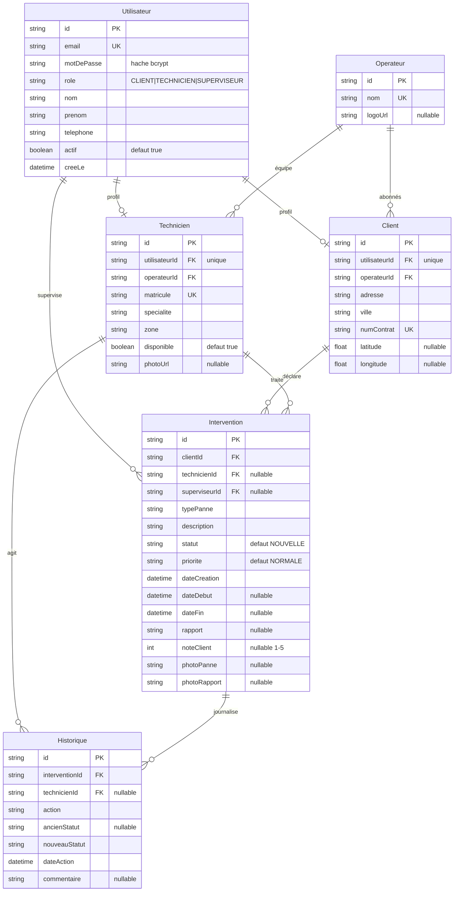

# FibreConnect

**FibreConnect est un sous-traitant de maintenance fibre optique en Tunisie.**
Ses techniciens sont ses propres employés, chacun habilité à intervenir sur le
réseau d'un seul opérateur — Tunisie Telecom, Ooredoo ou Orange. Le superviseur
est le dispatcheur de FibreConnect : il voit les trois réseaux parce que c'est
son entreprise qui intervient sur les trois.

Trois profils s'y croisent : l'abonné qui déclare une panne, le technicien qui
la traite sur le terrain, et le superviseur qui arbitre.

> **Ce que signifie `Technicien.operateurId`** : le réseau sur lequel le
> technicien est *habilité*, pas son employeur. C'est de là que découle la
> règle centrale du projet.

Projet de fin d'études (stage BTP).

---

## Sommaire

- [Ce que fait l'application](#ce-que-fait-lapplication)
- [Stack technique](#stack-technique)
- [Schéma de la base](#schéma-de-la-base)
- [Installation](#installation)
- [Identifiants de démonstration](#identifiants-de-démonstration)
- [Règles métier](#règles-métier)
- [Architecture](#architecture)
- [Sécurité](#sécurité)
- [Direction visuelle](#direction-visuelle)
- [Choix techniques notables](#choix-techniques-notables)
- [Limites connues](#limites-connues)

---

## Ce que fait l'application

| Rôle | Ce qu'il peut faire |
|---|---|
| **Client** | Déclarer une panne avec photo, suivre son avancement étape par étape, l'annuler, noter le technicien une fois l'intervention terminée |
| **Technicien** | Consulter les pannes **du réseau sur lequel il est habilité**, les accepter, les démarrer, rédiger le rapport de clôture avec photo, gérer son profil |
| **Superviseur** | Piloter les trois réseaux : statistiques, affectation manuelle, création et activation des comptes techniciens, carte des abonnés |

### Pages

```
/                               page de garde publique (trois portes)
/login                          formulaire unique, redirection selon le rôle
/register                       inscription, réservée aux abonnés

/client/dashboard               mes demandes + recherche et filtres
/client/nouvelle-panne          déclaration, avec photo facultative
/client/suivi/[id]              timeline, rapport, notation, annulation, impression
/client/profil                  coordonnées et mot de passe

/technicien/dashboard           pannes du réseau habilité
/technicien/mes-interventions   accepter / démarrer / terminer
/technicien/historique          interventions passées, rapports, notes
/technicien/profil              photo, spécialité, zone, disponibilité, mot de passe

/superviseur/dashboard          statistiques et graphiques
/superviseur/interventions      affectation, réaffectation, annulation
/superviseur/techniciens        équipe, activation des comptes
/superviseur/techniciens/nouveau  création d'un compte technicien
/superviseur/techniciens/[id]   fiche complète et journal d'activité
/superviseur/clients            liste et carte OpenStreetMap
/superviseur/reseaux            opérateurs partenaires, couverture, logos
/superviseur/profil             mot de passe
```

---

## Stack technique

| Domaine | Choix |
|---|---|
| Framework | Next.js 16 (App Router), React 19, TypeScript |
| Styles | Tailwind CSS v4 |
| Base de données | SQLite via Prisma ORM 6 |
| Authentification | NextAuth v4, provider Credentials |
| Mots de passe | bcryptjs, 10 rounds |
| Validation | zod |
| Graphiques | recharts |
| Cartographie | react-leaflet + OpenStreetMap (aucune clé API) |
| Tests | Vitest, sur une base SQLite jetable |

---

## Schéma de la base

Six tables. SQLite ne supportant pas les `enum` Prisma, les champs `role`,
`statut`, `priorite` et `typePanne` sont des `String` dont les valeurs
autorisées sont centralisées dans `lib/constants.ts` et validées par zod à
chaque écriture.



### Valeurs autorisées

| Champ | Valeurs |
|---|---|
| `role` | `CLIENT`, `TECHNICIEN`, `SUPERVISEUR` |
| `statut` | `NOUVELLE` → `ASSIGNEE` → `EN_COURS` → `TERMINEE`, plus `ANNULEE` |
| `priorite` | `BASSE`, `NORMALE`, `HAUTE`, `URGENTE` |
| `typePanne` | `COUPURE_TOTALE`, `DEBIT_FAIBLE`, `ONT_DEFECTUEUX`, `CABLE_ENDOMMAGE`, `NOUVELLE_INSTALLATION`, `CHANGEMENT_ROUTEUR`, `AUTRE` |

---

## Installation

**Prérequis** : Node.js 20.9 ou plus récent.

```bash
# 1. Dépendances
npm install

# 2. Variables d'environnement
cp .env.example .env
# puis générer une clé de session :
node -e "console.log(require('crypto').randomBytes(32).toString('base64'))"
# et la coller dans NEXTAUTH_SECRET

# 3. Créer la base et appliquer le schéma
npx prisma migrate dev

# 4. Charger le jeu de données de démonstration
npx prisma db seed

# 5. Lancer l'application
npm run dev
```

L'application démarre sur <http://localhost:3000>.

### Autres commandes

```bash
npm run build       # build de production
npm start           # lancer le build de production
npm test            # tests des règles métier (15 tests)
npm run test:watch  # tests en continu pendant le développement
npm run lint        # ESLint
npx tsc --noEmit    # vérification des types
npx prisma studio   # explorateur de base de données
npx prisma db seed  # réinitialiser le jeu de données
```

Le seed vide la base avant de la recréer : il est rejouable autant de fois que
nécessaire, et son tirage aléatoire est déterministe (graine fixe), donc deux
exécutions produisent exactement le même jeu de données.

---

## Identifiants de démonstration

Mot de passe commun à tous les comptes : **`Passer123`**

| Rôle | Adresse e-mail | Détail |
|---|---|---|
| Superviseur | `superviseur@fibreconnect.tn` | Leila Ben Salah |
| Technicien | `karim.bouazizi@fibreconnect.tn` | Tunisie Telecom · Tunis |
| Technicien | `sonia.trabelsi@fibreconnect.tn` | Tunisie Telecom · Ariana |
| Technicien | `mehdi.gharbi@fibreconnect.tn` | Ooredoo · Ben Arous |
| Technicien | `amine.jlassi@fibreconnect.tn` | Orange · Sfax |
| Client | `nadia.chaabane@example.tn` | Tunisie Telecom · Tunis |
| Client | `youssef.mansouri@example.tn` | Tunisie Telecom · Ariana |
| Client | `ines.khelifi@example.tn` | Tunisie Telecom · La Marsa |
| Client | `slim.ferchichi@example.tn` | Ooredoo · Ben Arous |
| Client | `rania.abdallah@example.tn` | Ooredoo · Sousse |
| Client | `hatem.zouari@example.tn` | Orange · Sfax |

Le jeu de données contient 3 opérateurs, 11 utilisateurs, 32 interventions
réparties sur 6 mois et 105 lignes d'historique.

La page `/login` affiche ces comptes dans un panneau dépliant. Passez
`NEXT_PUBLIC_MODE_DEMO="false"` dans `.env` pour le masquer en production.

### Scénario de démonstration

1. Connectez-vous en **client** (`nadia.chaabane@example.tn`) et déclarez une panne.
2. Connectez-vous en **technicien Tunisie Telecom** (`karim.bouazizi@…`) : la
   panne apparaît dans « Pannes disponibles ». Acceptez-la, démarrez-la, puis
   clôturez-la avec un rapport.
3. Connectez-vous en **technicien Orange** (`amine.jlassi@…`) : cette même panne
   n'apparaît **jamais**, l'abonné n'étant pas chez son opérateur. C'est la
   règle centrale du projet.
4. Revenez en **client** : la timeline montre chaque étape, et vous pouvez noter
   l'intervention.
5. Connectez-vous en **superviseur** pour voir les statistiques mises à jour,
   réaffecter une intervention ou désactiver un compte technicien.

---

## Règles métier

1. Une intervention est créée par un client avec le statut `NOUVELLE` et sans technicien.
2. **Un technicien ne voit que les interventions `NOUVELLE` dont le client
   appartient au même opérateur que lui.** C'est la règle centrale : elle est
   appliquée dans la requête SQL, et revérifiée côté serveur à l'acceptation.
3. Lorsqu'un technicien accepte : statut → `ASSIGNEE` et `technicienId` renseigné.
4. « Démarrer » → `EN_COURS` + `dateDebut`. « Terminer » → `TERMINEE` +
   `dateFin` + rapport obligatoire d'au moins 10 caractères.
5. Le superviseur peut créer un compte technicien, affecter ou réaffecter
   n'importe quelle intervention à n'importe quel technicien habilité sur le
   réseau de l'abonné, et désactiver un compte technicien (`actif = false`).
   La désactivation n'est jamais bloquée : si des interventions sont encore
   ouvertes, l'interface les compte et le signale avant de confirmer.
6. Un utilisateur dont le compte a `actif = false` ne peut pas se connecter.
7. Le client peut noter (1 à 5) une intervention `TERMINEE`, une seule fois.
8. Le client comme le superviseur peuvent annuler une intervention tant qu'elle
   n'est ni terminée ni déjà annulée. Un technicien ne le peut pas.

### Ces règles sont testées

`npm test` exécute 27 tests.

Les 15 premiers portent sur les règles métier et tournent contre une base
SQLite jetable, construite à partir des vraies migrations : cycle complet des
statuts, refus des transitions illégales, absence d'écriture d'historique quand
une transition est refusée, filtre par réseau, contrôles de propriété, notation
unique.

Les 12 suivants portent sur la limitation des tentatives de connexion. Le
limiteur reçoit l'instant courant en paramètre, si bien qu'une fenêtre de
quinze minutes se vérifie en quelques microsecondes et que le résultat ne
dépend jamais de la vitesse de la machine.

### Traçabilité

**Toute** transition de statut écrit une ligne dans `Historique`. Elle passe
obligatoirement par la fonction unique `changerStatut()` de
`lib/interventions.ts`, qui, dans une **transaction Prisma** :

1. vérifie que la transition est autorisée (`TRANSITIONS_STATUT`) ;
2. met à jour l'intervention ;
3. crée la ligne d'historique correspondante.

Si l'une des trois opérations échoue, aucune n'est appliquée. Aucune route ne
modifie `statut` directement.

---

## Architecture

```
app/
  page.tsx                 page de garde
  login/  register/        authentification
  client/  technicien/  superviseur/
                           un layout par espace, protégé par son rôle
  api/                     Route Handlers, réponses { data } ou { error }
components/
  ui/                      badges, boutons, champs, surfaces, squelettes
  navigation/              coquille applicative, rail latéral, notifications
  interventions/           lignes de liste, filtres, actions métier
  graphiques/              graphiques recharts du superviseur
  carte/                   carte Leaflet (chargée côté navigateur uniquement)
  timeline-intervention.tsx  élément signature
lib/
  constants.ts             valeurs autorisées, libellés, couleurs de statut
  prisma.ts                singleton du client Prisma
  interventions.ts         changerStatut() et contrôles de propriété
  validations.ts           schémas zod
  session.ts               exigerRole(), utilisateurConnecte()
  api.ts                   réponses et gestion d'erreurs communes
  statistiques.ts          calculs du tableau de bord superviseur
  notifications.ts         alertes dérivées des données
  filtres.ts  dates.ts     filtres d'URL, formatage des dates
proxy.ts                   protection des routes par rôle
prisma/
  schema.prisma  seed.ts  migrations/
```

Les composants sont des **Server Components** par défaut. `"use client"` n'est
utilisé que pour les formulaires, les graphiques, la carte et les quelques
éléments interactifs (cloche de notifications, barre de filtres).

---

## Sécurité

- **Mots de passe** hachés avec bcrypt (10 rounds). Jamais stockés ni renvoyés
  en clair, y compris par l'API de session.
- **Deux niveaux de contrôle.** `proxy.ts` filtre par URL en lisant le rôle dans
  le JWT signé, sans requête SQL. Chaque page et chaque route API revérifient
  ensuite le rôle **et la propriété** de la ressource : un technicien ne peut
  pas modifier l'intervention d'un collègue par un appel direct à l'API, un
  client ne peut pas consulter la demande d'un autre.
- **Validation zod** sur tous les payloads entrants.
- **Énumération d'adresses** empêchée : une adresse inconnue déclenche quand
  même une comparaison bcrypt, pour que le temps de réponse ne trahisse pas
  l'existence du compte. Mesuré : 50,4 ms contre 50,3 ms, soit 0,2 % d'écart.
- **Force brute** freinée par deux compteurs indépendants (`lib/limitation.ts`) :
  5 échecs sur une même adresse e-mail, ou 20 depuis une même adresse IP,
  bloquent la connexion pendant 15 minutes. Le seuil par IP existe pour arrêter
  la pulvérisation d'un mot de passe sur beaucoup de comptes, que le compteur
  par compte ne verrait jamais. Une tentative bloquée est refusée **avant** le
  calcul bcrypt, pour que la protection ne devienne pas elle-même un moyen de
  saturer le serveur.
- **En-têtes de sécurité** posés sur toutes les réponses (`next.config.ts`) :
  Content-Security-Policy, `X-Frame-Options: DENY`, `X-Content-Type-Options:
  nosniff`, Referrer-Policy et Permissions-Policy. La CSP n'autorise qu'une
  seule origine externe, les tuiles OpenStreetMap de la carte.
- **Photos** servies par une route authentifiée (`/api/photos/[nom]`) et non
  depuis `public/` : le nom doit correspondre exactement au format UUID que
  nous générons, ce qui interdit toute remontée de dossier. Le format d'image
  est vérifié sur les octets du fichier, pas sur son extension.
- **Redirection ouverte** empêchée : le paramètre `callbackUrl` n'est accepté
  que s'il désigne un chemin interne.
- **Erreurs techniques** journalisées côté serveur et jamais renvoyées au
  navigateur.

> Next.js 16 a renommé `middleware.ts` en `proxy.ts` (même rôle, runtime Node au
> lieu de edge). Le fichier `proxy.ts` remplit la fonction décrite dans le
> cahier des charges sous le nom de middleware.

---

## Direction visuelle

Le sujet est la fibre : de la lumière qui parcourt une distance et s'atténue.

- **Palette** — bleu nuit `#0B1D3A`, cyan signal `#22D3EE`, blanc cassé
  `#F5F7FA`, gris ardoise `#64748B`, ambre `#F59E0B`. Le cyan est réservé aux
  éléments actifs et aux traits de liaison, jamais en aplat de fond.
- **Page de garde** — une trace de réflectométrie (OTDR), la courbe que lit un
  technicien fibre, avec ses pics à chaque connecteur et chaque épissure.
- **Typographie** — Archivo pour les titres, IBM Plex Sans pour le texte,
  IBM Plex Mono pour les identifiants, matricules, dates et coordonnées.
- **Surfaces** — filets de 1 px et angles à 2 px, aucune carte arrondie à ombre
  portée. L'élément actif est marqué d'une arête cyan à gauche.
- **Élément signature** — sur la timeline d'une intervention, un trait cyan
  parcouru par une lueur qui progresse : le signal qui avance dans le câble.
  C'est la **seule** animation du projet, et elle disparaît entièrement sous
  `prefers-reduced-motion`.
- **Couleurs de statut**, constantes partout (badges, tableaux, graphiques) :
  `NOUVELLE` ardoise, `ASSIGNEE` bleu, `EN_COURS` ambre, `TERMINEE` vert,
  `ANNULEE` rouge.
- **Responsive** — rail latéral sur grand écran, barre d'onglets en bas sur
  téléphone, pour que le technicien atteigne la navigation au pouce. Testé
  jusqu'à 375 px de large.

---

## Choix techniques notables

**Prisma 6 plutôt que 7.** Prisma 7 impose un *driver adapter* pour SQLite et un
fichier `prisma.config.ts` réclamant `dotenv` : deux dépendances de plus et un
client généré hors de `@prisma/client`. La version 6 correspond au flux
classique décrit dans le cahier des charges.

**Filtres et recherche dans l'URL.** Les listes restent des pages rendues côté
serveur, une vue filtrée se partage par simple copie du lien, et le bouton
« précédent » du navigateur se comporte normalement.

**Notifications dérivées, pas stockées.** Il n'existe pas de table
`Notification` : chaque alerte est recalculée à partir des interventions. Rien
ne peut donc contredire la base, et aucune migration supplémentaire n'est
nécessaire. En contrepartie, il n'y a pas d'état « lu ».

**Export PDF par la fonction d'impression du navigateur.** Les fiches sont mises
en page pour le papier via `@media print`, plutôt que d'embarquer une
bibliothèque PDF. « Enregistrer au format PDF » est disponible dans la boîte de
dialogue d'impression de tous les systèmes.

**Aucune information ne dépend d'un seul contrôle.** Le proxy filtre par URL,
mais chaque page et chaque route API revérifient le rôle *et* la propriété de
la ressource. Cacher un bouton n'est pas un contrôle d'accès : les tests
vérifient qu'un technicien ne peut pas toucher l'intervention d'un collègue et
qu'un abonné ne peut pas lire celle d'un autre, même en appelant l'API
directement.

**Photos stockées sur le disque local**, dans `televersements/` à la racine du
projet — délibérément **pas** dans `public/`. Un build de production sert
`public/` depuis un instantané pris au moment de la compilation : un fichier
écrit ensuite renverrait 404. Elles passent donc par la route `/api/photos/
[nom]`, qui se comporte de la même façon en développement et en production. Le
nom de fichier est tiré au sort et le format est vérifié sur les octets du
fichier, pas sur son extension.

**Logos et portraits dégradent proprement.** Les logos des trois opérateurs
sont leur propriété et n'accompagnent pas ce dépôt ; le superviseur les
téléverse depuis `/superviseur/reseaux`. Tant qu'aucun fichier n'est posé,
l'interface affiche un monogramme (« TT », « OO », « OR ») et les initiales du
technicien — jamais un carré vide ni une silhouette grise.

**Accessibilité des couleurs.** Les couleurs de statut imposées par le cahier
des charges ont été passées à un validateur de contraste : « Terminée » (vert)
et « Annulée » (rouge) ne sont pas distinguables par une personne atteinte de
deutéranopie (ΔE 5,0 pour un seuil de 8). La palette a été conservée, mais
**aucune information ne repose sur la couleur seule** : chaque badge porte son
libellé, chaque barre de graphique affiche sa valeur, chaque série est nommée
dans une légende, et le tableau de bord propose une table de repli. La paire de
couleurs du graphique temporel (`#0891B2` / `#16A34A`) a été choisie parce
qu'elle passe les six contrôles du validateur.

---

## Limites connues

Elles sont listées ici parce qu'un projet honnête dit où il s'arrête.

**Le blocage des tentatives est en mémoire.** Il repart de zéro au redémarrage
du serveur et n'est pas partagé entre plusieurs instances. C'est exactement la
forme de déploiement de cette application — un processus Node à côté d'un
fichier SQLite — donc la protection est effective ; une mise à l'échelle
horizontale demanderait un magasin partagé.

**Le blocage par compte peut être retourné contre un utilisateur.** Quelqu'un
qui connaît une adresse e-mail peut la faire bloquer 15 minutes en échouant
cinq fois. C'est le compromis classique du verrouillage de compte : on préfère
une gêne bornée et réversible à une force brute illimitée.

**Deux `'unsafe-inline'` subsistent dans la CSP**, sur les scripts et les
styles. Next.js publie sa charge d'hydratation en `<script>` inline et Tailwind
comme Leaflet écrivent des attributs `style`. Les supprimer demande de générer
un *nonce* par requête et de le faire traverser le framework — un travail réel,
à refaire à chaque montée de version.

**Pas de pagination.** La liste des interventions du superviseur est plafonnée
à 100 lignes, avec un message quand le plafond est atteint. Suffisant pour une
démonstration, insuffisant au-delà.

**`notFound()` renvoie 200 au lieu de 404.** Comportement de Next 16 en rendu
par flux : la réponse a déjà commencé à partir quand la page appelle
`notFound()`. La page « introuvable » s'affiche correctement et aucune donnée
ne fuit — seul le code HTTP est inexact.

**SQLite et disque local.** Le cahier des charges impose SQLite ; la base est un
fichier et les photos sont à côté. Un hébergement au système de fichiers
éphémère perdrait les deux à chaque redémarrage.
