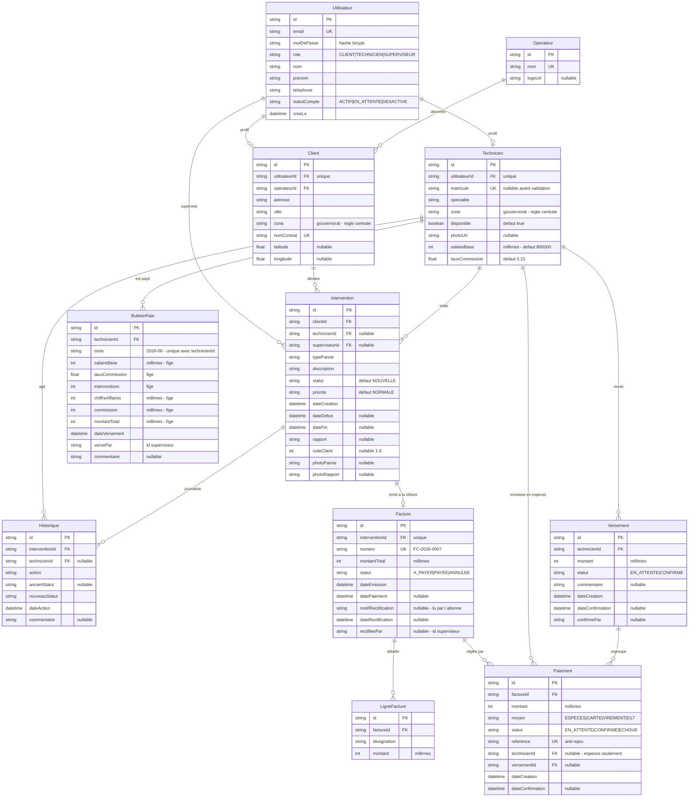

# FibreConnect

**FibreConnect est un sous-traitant de maintenance fibre optique en Tunisie.**
Ses techniciens sont ses propres employés : ils n'appartiennent à aucun
opérateur. La société dépanne les abonnés de deux réseaux partenaires —
Tunisie Telecom et Ooredoo — et chaque technicien couvre un **secteur
géographique**.

Trois profils s'y croisent : l'abonné qui déclare une panne, le technicien qui
la traite sur le terrain, et le superviseur qui arbitre.

> **Ce que signifie `Technicien.zone`** : le gouvernorat où le technicien se
> déplace. C'est de là que découle la règle centrale du projet — un technicien
> ne voit que les pannes de sa zone, quel que soit l'opérateur de l'abonné.
>
> L'opérateur reste dans le modèle, mais comme une information de contrat de
> l'abonné : il n'influe plus sur qui intervient.

Projet de fin d'études (stage BTP).

---

## Sommaire

- [Ce que fait l'application](#ce-que-fait-lapplication)
- [Stack technique](#stack-technique)
- [Schéma de la base](#schéma-de-la-base)
- [Délais de prise en charge](#délais-de-prise-en-charge)
- [Facturation et paiement](#facturation-et-paiement)
- [Installation](#installation)
- [Identifiants de démonstration](#identifiants-de-démonstration)
- [Règles métier](#règles-métier)
- [Architecture](#architecture)
- [Sécurité](#sécurité)
- [Direction visuelle](#direction-visuelle)
- [Choix techniques notables](#choix-techniques-notables)
- [Limites connues](#limites-connues)

---

## Ce que fait l'application

| Rôle | Ce qu'il peut faire |
|---|---|
| **Client** | S'inscrire seul, déclarer une panne avec photo, suivre son avancement étape par étape, l'annuler, **régler sa facture**, noter le technicien une fois l'intervention terminée |
| **Technicien** | S'inscrire seul (compte à valider), consulter les pannes **de sa zone**, les accepter, les démarrer, rédiger le rapport de clôture avec photo et les pièces facturées, **encaisser les espèces et les remettre à la société**, gérer son profil |
| **Superviseur** | Piloter l'activité : statistiques, couverture des zones, validation des inscriptions techniciens, attribution des matricules et des zones, affectation manuelle, carte des abonnés, **finances de la société et paie des techniciens** |

### Pages

```
/                               page de garde publique (trois portes)
/login                          formulaire unique, redirection selon le rôle
/register                       inscription, réservée aux abonnés
/register/technicien            candidature technicien (compte en attente)

/client/dashboard               mes demandes + recherche et filtres
/client/nouvelle-panne          déclaration, avec photo facultative
/client/suivi/[id]              timeline, rapport, facture et paiement, notation
/client/facture/[id]            la facture en document A4, à imprimer ou en PDF
/client/profil                  coordonnées, zone, mot de passe

/technicien/dashboard           pannes de la zone couverte
/technicien/mes-interventions   accepter / démarrer / terminer + pièces facturées
/technicien/caisse              factures à encaisser, espèces détenues, remises
/technicien/historique          interventions passées, rapports, notes
/technicien/profil              photo, spécialité, disponibilité, mot de passe

/superviseur/dashboard          statistiques, graphiques, couverture des zones
/superviseur/interventions      affectation, réaffectation, annulation
/superviseur/finances           encaissements, remises à confirmer, paie
/superviseur/factures/[id]      fiche facture : corriger ou annuler
/superviseur/techniciens        équipe par zone, validation, activation
/superviseur/techniciens/nouveau  création d'un compte technicien
/superviseur/techniciens/[id]   fiche, validation, changement de zone, journal
/superviseur/clients            liste et carte OpenStreetMap
/superviseur/reseaux            opérateurs partenaires et logos
/superviseur/profil             mot de passe
```

---

## Stack technique

| Domaine | Choix |
|---|---|
| Framework | Next.js 16 (App Router), React 19, TypeScript |
| Styles | Tailwind CSS v4 |
| Base de données | SQLite via Prisma ORM 6 |
| Authentification | NextAuth v4, provider Credentials |
| Mots de passe | bcryptjs, 10 rounds |
| Validation | zod |
| Graphiques | recharts |
| Cartographie | react-leaflet + OpenStreetMap (aucune clé API) |
| Tests | Vitest, sur une base SQLite jetable |

---

## Schéma de la base

Onze tables : six pour l'activité, cinq pour l'argent. SQLite ne supportant pas
les `enum` Prisma, les champs `role`, `statutCompte`, `statut`, `priorite`,
`typePanne`, `zone`, `moyen` et les statuts de facture, de paiement et de
versement sont des `String` dont les valeurs autorisées sont centralisées dans
`lib/constants.ts` et validées par zod à chaque écriture.

**Tous les montants sont des entiers en millimes** (1 DT = 1000 millimes),
jamais des décimaux — voir [Facturation et paiement](#facturation-et-paiement).

Noter qu'aucune relation ne relie `Operateur` à `Technicien` : c'est la
traduction dans le schéma du fait que les techniciens sont des employés de
FibreConnect. Le lien qui compte est `Client.zone` ↔ `Technicien.zone`.



### Valeurs autorisées

| Champ | Valeurs |
|---|---|
| `role` | `CLIENT`, `TECHNICIEN`, `SUPERVISEUR` |
| `statutCompte` | `ACTIF`, `EN_ATTENTE`, `DESACTIVE` |
| `statut` | `NOUVELLE` → `ASSIGNEE` → `EN_COURS` → `TERMINEE`, plus `ANNULEE` |
| `priorite` | `BASSE`, `NORMALE`, `HAUTE`, `URGENTE` |
| `typePanne` | `COUPURE_TOTALE`, `DEBIT_FAIBLE`, `ONT_DEFECTUEUX`, `CABLE_ENDOMMAGE`, `NOUVELLE_INSTALLATION`, `CHANGEMENT_ROUTEUR`, `AUTRE` |
| `zone` | `Tunis`, `Ariana`, `Ben Arous`, `Manouba`, `Nabeul`, `Bizerte`, `Sousse`, `Monastir`, `Sfax` |
| `moyen` | `ESPECES`, `CARTE`, `VIREMENT`, `D17` |
| `Facture.statut` | `A_PAYER`, `PAYEE`, `ANNULEE` |
| `Paiement.statut` | `EN_ATTENTE`, `CONFIRME`, `ECHOUE` |
| `Versement.statut` | `EN_ATTENTE`, `CONFIRME` |

**Pourquoi une liste fermée de gouvernorats et non la ville.** Comparer des
villes laisserait un abonné de « La Marsa » invisible pour le technicien qui
couvre « Tunis », et une simple faute de frappe masquerait une panne pour tout
le monde — sans message d'erreur, ce qui est la pire façon pour une règle
d'aiguillage d'échouer.

---

## Délais de prise en charge

Une priorité qui n'engage à rien n'est qu'une couleur. Chaque niveau porte donc
un délai, en heures, dans lequel la société s'engage à ce qu'un technicien
**accepte** la panne.

| Priorité | Délai | Ce que ça veut dire |
|---|---|---|
| Urgente | 4 h | Un abonné totalement coupé |
| Haute | 24 h | Une gêne sérieuse, mais la ligne fonctionne |
| Normale | 72 h | Le cas courant |
| Basse | 7 j | Confort, installation planifiée |

**Le chronomètre s'arrête à l'acceptation, et ne repart pas.** Ce que dure
ensuite la réparation dépend d'un câble dans le sol, pas de l'aiguillage ; le
compter ici transformerait un chantier difficile en promesse rompue. Le délai
mesure la seule chose que la société maîtrise vraiment : trouver quelqu'un.

**Quatre heures pour une urgence, pas une.** Un objectif raté à chaque fois
apprend à tout le monde à ignorer la couleur, ce qui est pire que de n'avoir
aucun objectif. Un délai n'est utile que tant qu'on y croit.

### Ce que ça change à l'écran

Chaque panne encore sans technicien porte un badge : « Il reste 3 h 12 », puis
« En retard de 6 h ». Il apparaît **chez le technicien et chez le superviseur,
jamais chez l'abonné** — un délai montré au client devient un engagement que la
société n'a pas pris, et « En retard de 6 h » sur l'écran de quelqu'un qui ne
peut rien y faire est un reproche sans remède. Le jour où la société veut en
faire une promesse publique, c'est un booléen à passer à `true`
(`afficherEcheance` dans [components/interventions/ligne-intervention.tsx](components/interventions/ligne-intervention.tsx)).

Le tableau de bord du technicien **classe par temps restant**, pas par étiquette
de priorité. À âge égal une urgente passe toujours devant une haute — la
priorité est déjà dans le délai qu'elle accorde. Ce que ce tri ajoute, c'est le
vieillissement : une normale de trois jours passe devant une basse du matin.
Surtout, la liste dit alors la même chose que le badge posé sur chaque ligne ;
un tri par priorité qui reléguerait en bas une panne marquée « En retard »
donnerait deux consignes contradictoires sur le même écran.

Le superviseur voit le nombre de pannes hors délai sur son tableau de bord,
reçoit une notification par panne concernée, et dispose d'un filtre **Délai →
Hors délai** sur la liste des interventions. Le compteur et la liste derrière le
lien viennent de la même clause SQL (`conditionHorsDelai` dans
[lib/filtres.ts](lib/filtres.ts)), donc ils ne peuvent pas diverger.

### Export comptable

Le superviseur télécharge trois documents depuis [/superviseur/finances](app/superviseur/finances/page.tsx) :

| Fichier | Contenu |
|---|---|
| `factures-AAAA-MM-JJ.csv` | Le registre complet, de la plus ancienne à la plus récente |
| `factures-impayees-AAAA-MM-JJ.csv` | Les seules non soldées |
| `paie-AAAA-MM.csv` | La paie d'un mois : fixe, commission, total, espèces détenues |

Les montants sortent en **nombres nus à virgule décimale** (`105,500`), sans
unité ni séparateur de milliers : une colonne « Montant » qui ne s'additionne
pas dans Excel ne sert à rien. Cette virgule suppose un Excel français, ce qui
est déjà l'hypothèse de [lib/csv.ts](lib/csv.ts) — les deux conventions vont de
pair, on ne peut pas en changer une seule.

Dans l'export de paie, « Espèces détenues » est la dernière colonne et reste à
l'écart : ce n'est pas ce que la société doit, c'est ce que le technicien lui
doit. Qui lit le fichier doit pouvoir additionner « À verser » sans que ce
chiffre s'invite dans le total.

---

## Facturation et paiement

### Qui doit quoi à qui

**L'abonné doit à la société, jamais au technicien.** Le technicien est un
salarié : il ne vend rien, il exécute. Cette phrase décide de toute
l'architecture financière de l'application.

```
                 ┌──────────────────────────────────────────┐
                 │  carte · virement · D17                  │
   Abonné ───────┼─────────────────────────────▶  Société   │
                 │                                     ▲    │
                 │  espèces                            │    │
                 └──────▶  Technicien  ──── remise ────┘    │
                                 ▲                          │
                                 └──── fixe + commission ────┘
```

Les espèces sont le seul cas où l'argent transite par quelqu'un. Le technicien
qui encaisse 120 DT sur le trottoir ne les a pas gagnés : il les **détient pour
le compte de la société**, et cette dette ne s'éteint qu'au moment où le
superviseur accuse réception de la remise.

### Les quatre moyens de paiement

| Moyen | Qui reçoit | Confirmation |
|---|---|---|
| Espèces au technicien | le technicien, pour le compte de la société | immédiate — l'argent a changé de main |
| Carte bancaire | la société | immédiate (passerelle) |
| D17 / e-Dinar | la société | immédiate (passerelle) |
| Virement bancaire | la société | **par le superviseur**, relevé bancaire en main |

Un virement annoncé n'est pas un virement reçu. L'abonné ne peut pas confirmer
le sien : la route API le refuse explicitement (403). Solder une facture sur
simple déclaration serait la faille la plus facile à exploiter de toute
l'application.

### La passerelle de paiement est simulée, et le dit

Aucun argent ne circule dans cette version. **Stripe n'accepte pas les comptes
marchands tunisiens**, et les prestataires locaux — Paymee, Flouci — demandent
un contrat signé qu'un projet d'études n'a pas les moyens d'obtenir. L'écran de
paiement affiche donc « Passerelle de paiement — simulation » : une fausse page
bancaire qui se ferait passer pour vraie serait la seule chose malhonnête de ce
projet.

Ce qui est conservé, c'est la **forme** d'une vraie passerelle : une intention
de paiement (`ouvrirPaiement`), puis une confirmation séparée
(`confirmerPaiement`). Le jour où un prestataire est raccordé, la confirmation
arrive d'un webhook au lieu d'un bouton, et rien d'autre ne change. Si le
paiement avait été enregistré en un seul appel, tout le flux serait à réécrire.

Le champ `Paiement.reference` est `@unique` : une notification rejouée par la
passerelle — ce qui arrive en production — ne compte pas l'encaissement deux
fois. Un test le vérifie en confirmant trois fois de suite.

### La facture naît avec la clôture

La facture est émise **dans la transaction même** qui passe l'intervention en
`TERMINEE` (paramètre `apres` de `changerStatut`). Une intervention terminée a
donc toujours exactement une facture. « Travaux faits, rien à payer » est un
état qu'aucune des deux parties ne saurait interpréter : il ne doit pas pouvoir
exister, même une seconde. Un test provoque un échec de facturation et vérifie
que l'intervention reste `EN_COURS`.

La première ligne est le déplacement, au tarif publié du type de panne — celui
qui a été annoncé à l'abonné quand il a déclaré sa panne, pas découvert à la
fin. Le technicien ajoute ensuite les pièces remplacées, une par ligne, au
moment de rédiger son rapport.

| Type de panne | Tarif |
|---|---|
| Coupure totale | 80,000 DT |
| Débit faible | 60,000 DT |
| ONT défectueux | 120,000 DT |
| Câble endommagé | 150,000 DT |
| Nouvelle installation | 250,000 DT |
| Changement de routeur | 100,000 DT |
| Autre | 70,000 DT |

### Le document

L'abonné dispose d'un exemplaire à garder, sur `/client/facture/[id]` : en-tête
de la société, bloc « Facturé à », détail ligne par ligne, règlements, solde. La
boîte d'impression du navigateur propose « Enregistrer au format PDF » sur toutes
les plateformes, ce qui évite d'embarquer une bibliothèque PDF pour un document
que le navigateur sait déjà produire.

C'est une page à part et non un panneau de plus sur le suivi : le suivi raconte
l'avancement d'une panne, la facture est une pièce qu'on conserve. Les mélanger
donnerait un document couvert de boutons dès qu'on l'imprime. Le document est
aussi **délibérément différent du reste de l'interface** — ni panneau, ni badge,
ni filet : le chrome qui aide à naviguer dans une liste ne fait que gêner qui
vérifie ce qu'il doit.

Le superviseur relit **exactement le même document** sur
`/superviseur/factures/[id]`. Deux rendus différents de la même facture
finiraient par diverger, et celui qui tiendrait le mauvais aurait raison de s'en
méfier.

> **Ce document n'est pas une facture fiscale, et il le dit.** Une facture
> tunisienne porte un matricule fiscal et de la TVA. Inventer un matricule
> plausible produirait un papier capable de passer pour un document officiel —
> exactement la ligne que ce projet trace déjà en refusant de simuler une page
> bancaire crédible. Les mentions manquantes sont signalées en pied de page, et
> `mentionsCompletes` dans [lib/societe.ts](lib/societe.ts) fait disparaître la
> note le jour où les vraies informations sont renseignées.

### Corriger une facture erronée

Un technicien qui tape 2100 DT au lieu de 210 DT crée une dette que l'abonné ne
peut pas contester et que personne ne peut réparer. Ce n'est pas un état
acceptable pour une application qui imprime des montants. Le superviseur
dispose donc de deux gestes, depuis `/superviseur/factures/[id]` :

| Geste | Effet | Quand |
|---|---|---|
| **Corriger** | Les lignes sont remplacées, le total recalculé | Erreur de montant ou de désignation |
| **Annuler** | L'abonné ne doit plus rien, la facture sort du chiffre d'affaires | Garantie, geste commercial — « rien à facturer » |

Les deux **refusent dès qu'un règlement a été confirmé, même partiellement** :
déplacer le total sous les pieds de quelqu'un qui a déjà payé une moitié produit
un chiffre qu'aucune des deux parties ne peut rapprocher. Ce cas-là demande un
avoir, que cette version ne gère pas.

Les deux **exigent un motif d'au moins dix caractères**, stocké sur la facture
et **affiché sur l'exemplaire de l'abonné**, à côté du nouveau montant. Un
montant qui change sans que personne sache pourquoi est indéfendable devant
l'abonné comme devant le technicien qui a établi la facture. « Erreur » ne dit
rien à qui relira la facture dans six mois.

L'annulation est **définitive** : l'intervention n'en recevra pas de nouvelle,
la relation étant un-à-un.

### Les montants sont des entiers de millimes

1 dinar = 1000 millimes. **Aucun montant n'est un décimal** dans cette
application : ni en base, ni en mémoire, ni dans les calculs. En JavaScript,
aujourd'hui encore :

```js
0.1 + 0.2 === 0.30000000000000004
```

Sur une facture, personne ne le voit. Sur une paie mensuelle qui additionne deux
cents commissions, le total cesse de correspondre à la somme des lignes
affichées au-dessus — et cela ne s'explique pas à un comptable. Les entiers
s'additionnent exactement, donc un total est toujours la somme de ce qui est
imprimé. SQLite n'a de toute façon pas de type décimal.

`lib/monnaie.ts` contient les seules fonctions autorisées à transformer un
montant en texte : `formaterMontant` (trois décimales, toujours) et
`formaterMontantCourt` (pour les graphiques).

### La rémunération du technicien

**Fixe + commission** : un salaire de base mensuel (800 DT par défaut) plus un
pourcentage du montant facturé (15 % par défaut), tous deux réglables par
technicien. La commission porte sur les interventions **terminées** dans le
mois, réglées ou non : le travail a été fait, et le recouvrement est l'affaire
de la société, pas celle du technicien.

Les espèces détenues sont affichées **à côté** de la paie, jamais déduites.
Mélanger « ce que nous vous devons » et « ce que vous détenez pour nous » dans
un seul nombre produit un chiffre sur lequel aucune des deux parties ne peut
agir — on ne rend pas la moitié d'un salaire.

**Le versement est enregistré, pas seulement calculé.** Quand le superviseur a
payé, il l'atteste depuis le tableau de paie : un `BulletinPaie` est créé. C'est
le pendant du `Versement`, dans l'autre sens — celui-ci enregistre l'argent qui
remonte du technicien vers la société, le bulletin celui qui descend. Sans lui,
la paie n'était qu'un calcul refait à chaque ouverture de page, et rien
n'empêchait de payer deux fois le même mois. La contrainte
`@@unique([technicienId, mois])` est cette garantie, posée en base et non dans
une vérification applicative — même rôle que `Paiement.reference`.

**Un bulletin fige ses montants**, exactement comme une facture fige les siens à
l'émission. Si une facture du mois est corrigée ensuite, la paie déjà versée ne
bouge pas : on ne réécrit pas un salaire qui a été payé. Le gel porte sur la
**ligne entière** et non sur le seul total — mélanger une commission recalculée
avec un total figé donnerait une ligne où le fixe plus la commission ne font pas
le total, et un tableau qui ne s'additionne pas est pire qu'un tableau périmé.

L'enregistrement est **définitif**, comme l'accusé de réception d'une remise
d'espèces : il atteste que de l'argent a changé de main hors de l'application.
Ce qui rend ce geste sûr, c'est qu'il n'est jamais un simple clic dans un
tableau — le bouton ouvre un panneau qui nomme le technicien, le mois et le
montant, et redemande confirmation. Cinq lignes d'un tableau se ressemblent, et
le bouton qui paie Karim est à deux centimètres de celui qui paie Sonia.

---

## Installation

**Prérequis** : Node.js 20.9 ou plus récent.

```bash
# 1. Dépendances
npm install

# 2. Variables d'environnement
cp .env.example .env
# puis générer une clé de session :
node -e "console.log(require('crypto').randomBytes(32).toString('base64'))"
# et la coller dans NEXTAUTH_SECRET

# 3. Créer la base et appliquer le schéma
npx prisma migrate dev

# 4. Charger le jeu de données de démonstration
npx prisma db seed

# 5. Lancer l'application
npm run dev
```

L'application démarre sur <http://localhost:3000>.

### Autres commandes

```bash
npm run build       # build de production
npm start           # lancer le build de production
npm test            # règles métier, limitation, pagination (50 tests)
npm run test:watch  # tests en continu pendant le développement
npm run lint        # ESLint
npx tsc --noEmit    # vérification des types
npx prisma studio   # explorateur de base de données
npx prisma db seed  # réinitialiser le jeu de données
```

Le seed vide la base avant de la recréer : il est rejouable autant de fois que
nécessaire, et son tirage aléatoire est déterministe (graine fixe), donc deux
exécutions produisent exactement le même jeu de données.

---

## Identifiants de démonstration

Mot de passe commun à tous les comptes : **`Passer123`**

| Rôle | Adresse e-mail | Matricule | Zone |
|---|---|---|---|
| Superviseur | `superviseur@fibreconnect.tn` | — | toutes |
| Technicien | `karim.bouazizi@fibreconnect.tn` | FC-001 | Tunis |
| Technicien | `sonia.trabelsi@fibreconnect.tn` | FC-002 | Ariana |
| Technicien | `mehdi.gharbi@fibreconnect.tn` | FC-003 | Ben Arous |
| Technicien | `amine.jlassi@fibreconnect.tn` | FC-004 | Sfax |
| Technicien | `yosr.hamdi@fibreconnect.tn` | FC-005 | Tunis |

| Rôle | Adresse e-mail | Opérateur | Ville (zone) |
|---|---|---|---|
| Client | `nadia.chaabane@example.tn` | Tunisie Telecom | Tunis (Tunis) |
| Client | `youssef.mansouri@example.tn` | Tunisie Telecom | Ariana (Ariana) |
| Client | `ines.khelifi@example.tn` | Tunisie Telecom | La Marsa (Tunis) |
| Client | `slim.ferchichi@example.tn` | Ooredoo | Ben Arous (Ben Arous) |
| Client | `rania.abdallah@example.tn` | Ooredoo | Sousse (Sousse) |
| Client | `hatem.zouari@example.tn` | Ooredoo | Sfax (Sfax) |

Le jeu de données contient 2 opérateurs, 12 utilisateurs, 33 interventions
réparties sur 6 mois, 106 lignes d'historique, 21 factures, 18 règlements,
4 remises d'espèces et 5 bulletins de paie.

Deux détails du jeu de données sont volontaires et servent la démonstration :

- **Inès habite La Marsa mais relève de la zone Tunis.** C'est le cas qui
  justifie de ne pas comparer les villes.
- **Rania est en zone Sousse, que personne ne couvre.** Sa panne n'apparaît
  chez aucun technicien, et le tableau de bord du superviseur l'affiche en
  alerte. Créez un technicien sur Sousse, ou affectez la panne à la main.
  C'est aussi **la seule panne hors délai** du jeu de données : déclarée il y a
  30 heures en priorité haute, dont le délai est de 24. Les deux faits vont
  ensemble, et c'est tout l'intérêt — une zone sans technicien ne produit pas
  une gêne abstraite, elle fait rater un engagement.
- **Quatre factures restent impayées et un virement reste annoncé.** Sans
  elles, l'écran de paiement du client, celui d'encaissement du technicien et
  la file de confirmation du superviseur se démontreraient vides — ce qui
  n'apprend rien à personne.
- **Quatre techniciens détiennent encore des espèces, un cinquième a déjà
  déclaré sa remise.** Les deux moitiés du circuit de l'argent liquide sont
  donc visibles en même temps.
- **La paie du mois précédent est versée, celle du mois en cours ne l'est pas.**
  Un tableau où toutes les lignes disent « Versée le… » ne montrerait jamais le
  bouton ; un tableau où aucune ne le dit ne montrerait jamais à quoi ressemble
  un mois payé. Le lien « Mois précédent » de la page Finances a ainsi quelque
  chose à montrer.

La page `/login` affiche ces comptes dans un panneau dépliant. Passez
`NEXT_PUBLIC_MODE_DEMO="false"` dans `.env` pour le masquer en production.

### Scénario de démonstration

1. Connectez-vous en **client** (`nadia.chaabane@example.tn`, zone Tunis) et
   déclarez une panne.
2. Connectez-vous en **technicien de la zone Tunis** (`karim.bouazizi@…`) : la
   panne apparaît dans « Pannes disponibles ». Acceptez-la, démarrez-la, puis
   clôturez-la avec un rapport.
3. Connectez-vous en **technicien de Sfax** (`amine.jlassi@…`) : cette même
   panne n'apparaît **jamais**, l'abonné n'étant pas dans sa zone. C'est la
   règle centrale du projet.
4. Revenez en **client** : la timeline montre chaque étape, la facture apparaît
   sous le rapport, et vous pouvez noter l'intervention.
5. Connectez-vous en **superviseur** pour voir les statistiques mises à jour,
   l'alerte sur la zone de Sousse, réaffecter une intervention ou désactiver
   un compte technicien.

### Scénario de démonstration du paiement

Le circuit de l'argent se démontre en trois connexions, sans rien préparer.

**Par carte, du côté de l'abonné.**

1. Connectez-vous en client `slim.ferchichi@example.tn` : deux de ses
   interventions terminées ont une facture non soldée.
2. Ouvrez le suivi de l'une d'elles : la facture est détaillée ligne par ligne
   sous le rapport du technicien.
3. Choisissez « Carte bancaire », puis « Payer ». L'écran de la passerelle
   simulée s'affiche, annonce qu'aucun argent ne circule, et attend votre
   confirmation. Confirmez : la facture passe en « Payée » et le règlement
   s'ajoute au bas de la facture avec sa référence.
4. « Voir la facture à imprimer » ouvre le document complet. Imprimez-le, ou
   enregistrez-le en PDF depuis la boîte d'impression du navigateur.

**En espèces, du côté du technicien.**

5. Connectez-vous en technicien `mehdi.gharbi@fibreconnect.tn` (FC-003) et
   ouvrez « Ma caisse » : la facture restante de Slim y figure.
6. « Encaisser en espèces », le montant est déjà rempli. Validez : la facture
   est soldée, et l'indicateur « Espèces en main » augmente d'autant. Cet
   argent est désormais **dû par le technicien à la société**.
7. « Déclarer la remise » : les espèces quittent la ligne « en main » et
   passent en attente d'accusé de réception.

**Du côté du superviseur.**

8. Connectez-vous en superviseur, page **Finances**. La remise de Mehdi attend
   votre accusé de réception, et un virement annoncé attend d'être pointé sur
   le relevé bancaire.
9. Accusez réception de la remise : elle passe en « Reçue par la société » et
   l'indicateur « Espèces chez les techniciens » baisse.
10. Confirmez le virement : la facture correspondante se solde.
11. En bas de page, le tableau de paie montre pour chaque technicien son fixe,
    sa commission sur ce qu'il a facturé ce mois-ci, et — dans une colonne
    séparée, jamais déduite — les espèces qu'il détient encore.
12. « Enregistrer le versement » sur une ligne : un panneau nomme le technicien,
    le mois et le montant, et redemande confirmation. La ligne passe à
    « Versée le… », et le bouton disparaît — ce mois-là ne peut plus être payé
    une seconde fois. Suivez « Mois précédent » pour voir un mois entièrement
    versé, puis exportez la paie en CSV.

Essayez aussi de confirmer un virement **depuis le compte de l'abonné** : la
route le refuse. C'est la société qui constate l'arrivée de l'argent, pas
celui qui prétend l'avoir envoyé.

### Démonstration de l'inscription technicien

1. Depuis `/login`, suivez « Déposer une candidature » et inscrivez-vous en
   choisissant la zone **Sousse**.
2. Essayez de vous connecter : la connexion est refusée avec « votre compte sera
   actif dès que le superviseur l'aura validé ».
3. En **superviseur**, page Techniciens : la demande est en tête de liste.
   Ouvrez-la, attribuez un matricule, validez.
4. Reconnectez-vous avec le compte technicien : la panne de Rania, que personne
   ne voyait, apparaît enfin — et l'alerte de couverture disparaît du tableau
   de bord.

---

## Règles métier

1. Une intervention est créée par un client avec le statut `NOUVELLE` et sans technicien.
2. **Un technicien ne voit que les interventions `NOUVELLE` dont le client est
   dans la même zone que lui.** C'est la règle centrale : elle est appliquée
   dans la requête SQL, et revérifiée côté serveur à l'acceptation. L'opérateur
   de l'abonné n'entre pas dans ce filtre.
3. Lorsqu'un technicien accepte : statut → `ASSIGNEE` et `technicienId` renseigné.
   Deux techniciens d'une même zone voient la même panne : l'acceptation passe
   par un `updateMany` conditionnel, jamais par une lecture suivie d'une
   écriture, pour qu'un seul l'obtienne.
4. « Démarrer » → `EN_COURS` + `dateDebut`. « Terminer » → `TERMINEE` +
   `dateFin` + rapport obligatoire d'au moins 10 caractères.
5. Le superviseur peut créer un compte technicien, affecter ou réaffecter
   n'importe quelle intervention à n'importe quel technicien — **y compris hors
   de sa zone**, ce que l'historique consigne mot pour mot. C'est le seul
   recours quand une zone n'a personne. Il peut aussi désactiver un compte,
   ce qui n'est jamais bloqué : si des interventions sont encore ouvertes,
   l'interface les compte et le signale avant de confirmer.
6. Seul un compte `ACTIF` peut se connecter. `EN_ATTENTE` et `DESACTIVE` sont
   refusés, avec des messages distincts — une inscription en cours d'examen
   n'est pas un rejet.
7. Le client peut noter (1 à 5) une intervention `TERMINEE`, une seule fois.
8. Le client comme le superviseur peuvent annuler une intervention tant qu'elle
   n'est ni terminée ni déjà annulée. Un technicien ne le peut pas.
9. Un technicien peut s'inscrire seul depuis `/register/technicien`. Son compte
   naît `EN_ATTENTE`, sans matricule et marqué indisponible. Le superviseur lui
   attribue matricule et zone, ce qui l'active — en un seul geste, dans une
   transaction, pour qu'aucun état intermédiaire absurde n'existe (compte actif
   sans matricule, ou technicien affecté qui ne peut pas se connecter).
10. La zone d'un technicien n'est pas dans le profil qu'il modifie lui-même :
    elle décide des pannes qui lui sont proposées, la choisir reviendrait à
    choisir son travail. Seul le superviseur la change.
11. La clôture émet la facture **dans la même transaction**. Une intervention
    terminée a toujours exactement une facture, et une facture n'existe pas sans
    intervention terminée.
12. Une facture n'est soldée que par des paiements **confirmés**. Un virement
    annoncé ne réduit rien tant que le superviseur ne l'a pas vu sur le relevé,
    et l'abonné ne peut pas confirmer le sien.
13. Les espèces encaissées par un technicien créent une dette de celui-ci envers
    la société. Elle s'éteint en deux temps volontairement distincts : le
    technicien **déclare** la remise, le superviseur **accuse réception**.
    Confondre les deux reviendrait à croire sur parole un mouvement d'espèces.
14. Le montant d'une remise n'est jamais envoyé par le client : il est calculé
    côté serveur à partir des encaissements non encore versés. Un champ libre
    permettrait de déclarer 200 DT en en gardant 400.
15. Une facture peut être **corrigée ou annulée par le superviseur tant qu'aucun
    règlement n'a été confirmé**, avec un motif obligatoire que l'abonné lit sur
    son exemplaire. Après un règlement, même partiel, elle est figée.
16. Chaque priorité porte un **délai de prise en charge**. Une panne encore
    `NOUVELLE` au-delà de son délai est *hors délai* ; dès qu'un technicien
    accepte, le chronomètre s'arrête et ne repart pas.
17. Le tableau de bord du technicien classe par **temps restant**, pas par
    étiquette de priorité, pour que la liste et les badges disent la même chose.
18. La paie versée est **enregistrée**, pas seulement calculée. Un mois ne peut
    pas être payé deux fois (contrainte d'unicité en base), et les montants d'un
    bulletin sont figés à l'enregistrement.

### Ces règles sont testées

`npm test` exécute 91 tests.

Les 25 premiers portent sur les règles métier et tournent contre une base
SQLite jetable, construite à partir des vraies migrations : cycle complet des
statuts, refus des transitions illégales, absence d'écriture d'historique quand
une transition est refusée, filtre par zone, contrôles de propriété, notation
unique.

Deux d'entre eux méritent d'être signalés :

- **Le filtre ignore l'opérateur.** Les deux abonnés du jeu de test partagent le
  même opérateur et diffèrent par la zone. Si la règle centrale retombait un
  jour sur `operateurId`, ce test échouerait — alors qu'avec deux opérateurs
  différents il aurait passé pour la mauvaise raison.
- **L'acceptation concurrente.** Deux techniciens de la même zone acceptent la
  même panne en parallèle : le test vérifie qu'un seul `updateMany` touche une
  ligne, l'autre zéro.

Les 12 suivants portent sur la limitation des tentatives de connexion. Le
limiteur reçoit l'instant courant en paramètre, si bien qu'une fenêtre de
quinze minutes se vérifie en quelques microsecondes et que le résultat ne
dépend jamais de la vitesse de la machine.

13 autres portent sur la pagination : qu'aucune ligne ne soit sautée ni
comptée deux fois en parcourant toutes les pages, qu'une URL bricolée à la main
retombe sur une page valide, et que les liens de page conservent les filtres.

29 portent sur l'argent, et vérifient qu'on ne peut ni en créer ni
en perdre par les chemins que l'application propose :

- une confirmation de paiement **rejouée trois fois** ne compte l'encaissement
  qu'une seule fois ;
- un virement `EN_ATTENTE` ne solde rien ;
- on ne peut pas encaisser plus que le reste dû, ni ouvrir un paiement sur une
  facture déjà soldée, ni payer en espèces depuis l'espace client ;
- si la facturation échoue, la clôture est annulée et l'intervention reste
  `EN_COURS` — jamais de travaux sans facture ;
- un total de facture est **exactement** la somme des lignes affichées ;
- une remise déclarée deux fois est refusée, un accusé de réception donné deux
  fois aussi ;
- une facture ne se corrige ni ne s'annule dès qu'un règlement est confirmé, et
  une facture annulée sort du chiffre d'affaires ;
- un mois de paie ne se verse pas deux fois, et une facture corrigée après le
  versement ne réécrit **aucun** des chiffres du bulletin — la ligne figée
  continue de s'additionner.

Les 12 restants portent sur les délais et sur les deux formats que les exports
utilisent. Tous sont des **fonctions pures** auxquelles l'instant courant est
passé en paramètre : un objectif de quatre heures se vérifie en microsecondes
au lieu de s'attendre, et le résultat ne dépend jamais de l'heure à laquelle la
suite tourne. Ils vérifient notamment qu'une panne acceptée n'est jamais hors
délai quel que soit son âge, qu'un `priorite` inconnu retombe sur le délai
normal sans disparaître du décompte, et qu'un paramètre `mois` bricolé à la main
retombe sur le mois en cours au lieu de casser la page.

### Traçabilité

**Toute** transition de statut écrit une ligne dans `Historique`. Elle passe
obligatoirement par la fonction unique `changerStatut()` de
`lib/interventions.ts`, qui, dans une **transaction Prisma** :

1. vérifie que la transition est autorisée (`TRANSITIONS_STATUT`) ;
2. met à jour l'intervention ;
3. crée la ligne d'historique correspondante.

Si l'une des trois opérations échoue, aucune n'est appliquée. Aucune route ne
modifie `statut` directement.

---

## Architecture

```
app/
  page.tsx                 page de garde
  login/  register/        authentification
  client/  technicien/  superviseur/
                           un layout par espace, protégé par son rôle
  api/                     Route Handlers, réponses { data } ou { error }
components/
  ui/                      badges, boutons, champs, surfaces, squelettes
  navigation/              coquille applicative, rail latéral, notifications
  interventions/           lignes de liste, filtres, actions métier
  facturation/             facture, paiement, encaissement, remises
  graphiques/              graphiques recharts du superviseur
  carte/                   carte Leaflet (chargée côté navigateur uniquement)
  timeline-intervention.tsx  élément signature
lib/
  constants.ts             valeurs autorisées, libellés, couleurs de statut
  prisma.ts                singleton du client Prisma
  interventions.ts         changerStatut() et contrôles de propriété
  facturation.ts           émission, solde, encaissement, remises, paie
  monnaie.ts               montants en millimes, jamais en décimaux
  societe.ts               identité imprimée en tête de facture
  validations.ts           schémas zod
  session.ts               exigerRole(), utilisateurConnecte()
  api.ts                   réponses et gestion d'erreurs communes
  statistiques.ts          calculs du tableau de bord superviseur
  notifications.ts         alertes dérivées des données
  filtres.ts  dates.ts     filtres d'URL, formatage des dates
  pagination.ts            bornes de page, liens qui gardent les filtres
  limitation.ts            blocage des tentatives de connexion
  televersement.ts         enregistrement et contrôle des photos
proxy.ts                   protection des routes par rôle
prisma/
  schema.prisma  seed.ts  migrations/
```

Les composants sont des **Server Components** par défaut. `"use client"` n'est
utilisé que pour les formulaires, les graphiques, la carte et les quelques
éléments interactifs (cloche de notifications, barre de filtres).

---

## Sécurité

- **Mots de passe** hachés avec bcrypt (10 rounds). Jamais stockés ni renvoyés
  en clair, y compris par l'API de session.
- **Deux niveaux de contrôle.** `proxy.ts` filtre par URL en lisant le rôle dans
  le JWT signé, sans requête SQL. Chaque page et chaque route API revérifient
  ensuite le rôle **et la propriété** de la ressource : un technicien ne peut
  pas modifier l'intervention d'un collègue par un appel direct à l'API, un
  client ne peut pas consulter la demande d'un autre.
- **Validation zod** sur tous les payloads entrants.
- **Énumération d'adresses** empêchée : une adresse inconnue déclenche quand
  même une comparaison bcrypt, pour que le temps de réponse ne trahisse pas
  l'existence du compte. Mesuré : 50,4 ms contre 50,3 ms, soit 0,2 % d'écart.
- **Force brute** freinée par deux compteurs indépendants (`lib/limitation.ts`) :
  5 échecs sur une même adresse e-mail, ou 20 depuis une même adresse IP,
  bloquent la connexion pendant 15 minutes. Le seuil par IP existe pour arrêter
  la pulvérisation d'un mot de passe sur beaucoup de comptes, que le compteur
  par compte ne verrait jamais. Une tentative bloquée est refusée **avant** le
  calcul bcrypt, pour que la protection ne devienne pas elle-même un moyen de
  saturer le serveur.
- **En-têtes de sécurité** posés sur toutes les réponses (`next.config.ts`) :
  Content-Security-Policy, `X-Frame-Options: DENY`, `X-Content-Type-Options:
  nosniff`, Referrer-Policy et Permissions-Policy. La CSP n'autorise qu'une
  seule origine externe, les tuiles OpenStreetMap de la carte.
- **Photos** servies par une route authentifiée (`/api/photos/[nom]`) et non
  depuis `public/` : le nom doit correspondre exactement au format UUID que
  nous générons, ce qui interdit toute remontée de dossier. Le format d'image
  est vérifié sur les octets du fichier, pas sur son extension.
- **Redirection ouverte** empêchée : le paramètre `callbackUrl` n'est accepté
  que s'il désigne un chemin interne.
- **Argent.** Aucun montant ne vient du navigateur : le reste à payer est
  toujours recalculé côté serveur, le montant d'une remise est déduit des
  encaissements en base, et un technicien ne peut encaisser que sur les
  factures de ses propres interventions (403 sinon). La référence d'un paiement
  est unique, ce qui rend une notification rejouée sans effet.
- **Erreurs techniques** journalisées côté serveur et jamais renvoyées au
  navigateur.

> Next.js 16 a renommé `middleware.ts` en `proxy.ts` (même rôle, runtime Node au
> lieu de edge). Le fichier `proxy.ts` remplit la fonction décrite dans le
> cahier des charges sous le nom de middleware.

---

## Direction visuelle

Le sujet est la fibre : de la lumière qui parcourt une distance et s'atténue.

- **Palette** — bleu nuit `#0B1D3A`, cyan signal `#22D3EE`, blanc cassé
  `#F5F7FA`, gris ardoise `#64748B`, ambre `#F59E0B`. Le cyan est réservé aux
  éléments actifs et aux traits de liaison, jamais en aplat de fond.
- **Page de garde** — une trace de réflectométrie (OTDR), la courbe que lit un
  technicien fibre, avec ses pics à chaque connecteur et chaque épissure.
- **Typographie** — Archivo pour les titres, IBM Plex Sans pour le texte,
  IBM Plex Mono pour les identifiants, matricules, dates et coordonnées.
- **Surfaces** — filets de 1 px et angles à 2 px, aucune carte arrondie à ombre
  portée. L'élément actif est marqué d'une arête cyan à gauche.
- **Élément signature** — sur la timeline d'une intervention, un trait cyan
  parcouru par une lueur qui progresse : le signal qui avance dans le câble.
  C'est la **seule** animation du projet, et elle disparaît entièrement sous
  `prefers-reduced-motion`.
- **Couleurs de statut**, constantes partout (badges, tableaux, graphiques) :
  `NOUVELLE` ardoise, `ASSIGNEE` bleu, `EN_COURS` ambre, `TERMINEE` vert,
  `ANNULEE` rouge.
- **Responsive** — rail latéral sur grand écran, barre d'onglets en bas sur
  téléphone, pour que le technicien atteigne la navigation au pouce. Testé
  jusqu'à 375 px de large.

### Ce que « responsive » veut dire ici

Le cahier des charges demande que l'application soit utilisable par un
technicien debout devant un point de branchement. Cela va au-delà d'une mise en
page qui se replie :

- **Cibles tactiles de 44 px.** Les boutons d'action — « Accepter
  l'intervention », « Démarrer » — mesuraient 28 px de haut : trop petits pour
  un pouce. La variante `pointer-coarse:` les porte à 44 px sur écran tactile
  **sans** relâcher la densité au clavier-souris.
- **Délai de double-tap supprimé.** Sans `touch-action: manipulation`, un
  navigateur mobile attend 300 ms après chaque appui pour voir si un second
  arrive. Toute l'application paraissait lente.
- **Encoche respectée.** La barre de navigation du bas était recouverte par
  l'indicateur d'accueil d'un iPhone. `env(safe-area-inset-bottom)`, combiné à
  `viewportFit: "cover"`, la repousse au-dessus.

### Accessibilité

- **Lien d'évitement** en première cible du clavier : sans lui, il faut
  traverser toute la navigation à chaque page avant d'atteindre le contenu.
- **Focus clavier visible** partout, y compris sur fond sombre, jamais
  supprimé sans remplacement.
- **Le panneau d'alertes** est annoncé comme un dialogue, et `Échap` y rend le
  focus à la cloche plutôt que de le laisser retomber en haut de page.
- **Aucun bouton grisé sans explication.** Un bouton d'envoi désactivé
  n'apprend rien : les formulaires restent actifs, valident à la soumission et
  renvoient la personne sur le champ fautif avec ce qui manque.
- **Le correcteur orthographique est coupé** sur les adresses e-mail, les
  matricules et les numéros de contrat, qu'il soulignait en rouge à tort.

### Typographie française

L'espace insécable est posée avant `? ! ; :` et à l'intérieur des guillemets
`« »`, selon l'usage français — une ponctuation double ne doit jamais se
retrouver seule en début de ligne.

---

## Choix techniques notables

**Prisma 6 plutôt que 7.** Prisma 7 impose un *driver adapter* pour SQLite et un
fichier `prisma.config.ts` réclamant `dotenv` : deux dépendances de plus et un
client généré hors de `@prisma/client`. La version 6 correspond au flux
classique décrit dans le cahier des charges.

**Filtres, recherche et pagination dans l'URL.** Les listes restent des pages
rendues côté serveur, une vue filtrée se partage par simple copie du lien, et le
bouton « précédent » du navigateur se comporte normalement. La navigation entre
pages est faite de vrais liens : un clic du milieu ouvre la page 3 dans un
nouvel onglet, et la version imprimée ne montre pas les boutons.

Deux pièges de pagination sont traités explicitement, parce qu'ils ne se voient
qu'une fois en production :

- changer un filtre depuis la page 5 remettrait devant une liste vide alors que
  le résultat tient sur une page — `BarreFiltres` efface donc `page` à chaque
  changement de critère ;
- `?page=999` ou `?page=-3` bricolés à la main retombent sur une page valide au
  lieu de produire un `skip` négatif ou un écran vide.

**Notifications dérivées, pas stockées.** Il n'existe pas de table
`Notification` : chaque alerte est recalculée à partir des interventions. Rien
ne peut donc contredire la base, et aucune migration supplémentaire n'est
nécessaire. En contrepartie, il n'y a pas d'état « lu ».

**Export PDF par la fonction d'impression du navigateur.** Les fiches sont mises
en page pour le papier via `@media print`, plutôt que d'embarquer une
bibliothèque PDF. « Enregistrer au format PDF » est disponible dans la boîte de
dialogue d'impression de tous les systèmes.

**Aucune information ne dépend d'un seul contrôle.** Le proxy filtre par URL,
mais chaque page et chaque route API revérifient le rôle *et* la propriété de
la ressource. Cacher un bouton n'est pas un contrôle d'accès : les tests
vérifient qu'un technicien ne peut pas toucher l'intervention d'un collègue et
qu'un abonné ne peut pas lire celle d'un autre, même en appelant l'API
directement.

**Photos stockées sur le disque local**, dans `televersements/` à la racine du
projet — délibérément **pas** dans `public/`. Un build de production sert
`public/` depuis un instantané pris au moment de la compilation : un fichier
écrit ensuite renverrait 404. Elles passent donc par la route `/api/photos/
[nom]`, qui se comporte de la même façon en développement et en production. Le
nom de fichier est tiré au sort et le format est vérifié sur les octets du
fichier, pas sur son extension.

**Logos et portraits dégradent proprement.** Les logos des opérateurs
partenaires sont leur propriété et n'accompagnent pas ce dépôt ; le superviseur
les téléverse depuis `/superviseur/reseaux`. Tant qu'aucun fichier n'est posé,
l'interface affiche un monogramme (« TT », « OO ») et les initiales du
technicien — jamais un carré vide ni une silhouette grise.

**Accessibilité des couleurs.** Les couleurs de statut imposées par le cahier
des charges ont été passées à un validateur de contraste : « Terminée » (vert)
et « Annulée » (rouge) ne sont pas distinguables par une personne atteinte de
deutéranopie (ΔE 5,0 pour un seuil de 8). La palette a été conservée, mais
**aucune information ne repose sur la couleur seule** : chaque badge porte son
libellé, chaque barre de graphique affiche sa valeur, chaque série est nommée
dans une légende, et le tableau de bord propose une table de repli.

Les couleurs elles-mêmes ont été re-mesurées plutôt que choisies à l'œil : les
évidents `#16A34A` / `#DC2626` donnent ΔE 5,0 sous deutéranopie, sous le seuil
de 8. La paire retenue est `#15803D` / `#921C1C` (ΔE 8,7), séparée sur la
clarté — le seul canal qu'un daltonisme laisse intact. Le graphique temporel
utilise `#1D4ED8` / `#15803D`, ΔE 27,3.

---

## Limites connues

Elles sont listées ici parce qu'un projet honnête dit où il s'arrête.

**Le blocage des tentatives est en mémoire.** Il repart de zéro au redémarrage
du serveur et n'est pas partagé entre plusieurs instances. C'est exactement la
forme de déploiement de cette application — un processus Node à côté d'un
fichier SQLite — donc la protection est effective ; une mise à l'échelle
horizontale demanderait un magasin partagé.

**Le blocage par compte peut être retourné contre un utilisateur.** Quelqu'un
qui connaît une adresse e-mail peut la faire bloquer 15 minutes en échouant
cinq fois. C'est le compromis classique du verrouillage de compte : on préfère
une gêne bornée et réversible à une force brute illimitée.

**Deux `'unsafe-inline'` subsistent dans la CSP**, sur les scripts et les
styles. Next.js publie sa charge d'hydratation en `<script>` inline et Tailwind
comme Leaflet écrivent des attributs `style`. Les supprimer demande de générer
un *nonce* par requête et de le faire traverser le framework — un travail réel,
à refaire à chaque montée de version.

**Deux listes restent non paginées.** La carte des abonnés
(`/superviseur/clients`) charge tout, parce qu'une carte paginée n'aurait pas
de sens. Et l'historique du technicien calcule ses moyennes sur l'ensemble de
ses interventions terminées : la liste affichée est paginée, mais le calcul de
la durée moyenne lit encore toutes les lignes — SQLite ne sait pas faire la
moyenne d'une différence de dates sans SQL brut.

**`notFound()` renvoie 200 au lieu de 404.** Comportement de Next 16 en rendu
par flux : la réponse a déjà commencé à partir quand la page appelle
`notFound()`. La page « introuvable » s'affiche correctement et aucune donnée
ne fuit — seul le code HTTP est inexact.

**SQLite et disque local.** Le cahier des charges impose SQLite ; la base est un
fichier et les photos sont à côté. Un hébergement au système de fichiers
éphémère perdrait les deux à chaque redémarrage.

**Aucun paiement réel n'est encaissé.** La passerelle est simulée et l'écran le
dit. Stripe n'accepte pas les comptes marchands tunisiens ; brancher Paymee ou
Flouci demande un contrat commercial signé. Le découpage en deux temps
(`ouvrirPaiement` puis `confirmerPaiement`, dans `lib/facturation.ts`) est
précisément celui qu'attendent ces prestataires : la confirmation viendrait
d'un webhook au lieu d'un bouton.

**Une facture déjà réglée ne se corrige pas.** Le superviseur peut corriger ou
annuler une facture tant qu'aucun règlement n'a été confirmé, mais après un
encaissement — même partiel — elle est figée. Le geste juste serait alors un
**avoir**, qui laisse la facture d'origine intacte et lui oppose un document de
sens contraire. Il demande une table de plus et, surtout, de renoncer à la
relation un-à-un entre intervention et facture, puisqu'il faudrait pouvoir en
réémettre une. C'est un choix de modélisation, pas un oubli.

**Aucune TVA, aucun matricule fiscal.** Les montants sont des totaux nets et le
document le dit en pied de page. Les ajouter n'est pas qu'un champ de plus : il
faut un taux par ligne, un sous-total hors taxe, et le choix de ce qui est
assujetti — une question comptable, pas technique.

**Un bulletin de paie ne s'annule pas.** L'enregistrement du versement est
définitif, comme l'accusé de réception d'une remise d'espèces. Une erreur de
saisie se corrige aujourd'hui en base. L'ajouter proprement demanderait le même
mécanisme que la rectification de facture — motif, trace, auteur — et la
question de savoir ce que devient la contrainte d'unicité une fois le bulletin
annulé.
